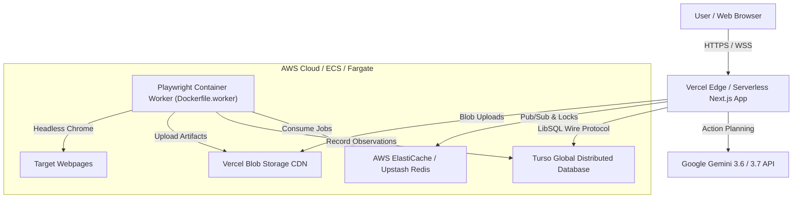

# BrowserPilot — Production Deployment Guide (AWS & Vercel)

This document provides complete instructions for deploying BrowserPilot to production using a **Vercel + AWS Hybrid Architecture**.

---

## 🏗️ Production Architecture



---

## 🔑 Environment Variable Matrix

| Variable | Description | Where to Set | Required? |
|---|---|---|---|
| `TURSO_DATABASE_URL` | Turso LibSQL Cloud URL (`libsql://...`) | Vercel & AWS Worker | **Yes** |
| `TURSO_AUTH_TOKEN` | Turso Database JWT token | Vercel & AWS Worker | **Yes** |
| `NEXTAUTH_SECRET` | NextAuth session encryption key | Vercel | **Yes** |
| `NEXTAUTH_URL` | Production app URL (`https://browserpilot-iota.vercel.app`) | Vercel | **Yes** |
| `GEMINI_API_KEY` | Google Gemini AI Key (Fallback / System Key) | Vercel & AWS Worker | **Yes** |
| `REDIS_URL` | Redis endpoint (`rediss://...` or `redis://...`) | Vercel & AWS Worker | Recommended |
| `BLOB_READ_WRITE_TOKEN` | Vercel Blob read/write token for screenshot storage | Vercel & AWS Worker | Recommended |
| `BROWSER_WS_ENDPOINT` | Remote Playwright WebSocket endpoint | Vercel | Optional |

---

## 🚀 Option 1: Vercel Frontend + AWS ECS Fargate Worker

### Step 1: Deploy Web Application on Vercel
1. Import repository on [Vercel Dashboard](https://vercel.com).
2. Configure environment variables in **Project Settings → Environment Variables**.
3. Deploy branch `main`.

### Step 2: Deploy Playwright Worker on AWS ECS
1. Build and push `Dockerfile.worker` to AWS ECR:
   ```bash
   aws ecr get-login-password --region <region> | docker login --username AWS --password-stdin <account_id>.dkr.ecr.<region>.amazonaws.com
   docker build -t browserpilot-worker -f Dockerfile.worker .
   docker tag browserpilot-worker:latest <account_id>.dkr.ecr.<region>.amazonaws.com/browserpilot-worker:latest
   docker push <account_id>.dkr.ecr.<region>.amazonaws.com/browserpilot-worker:latest
   ```
2. Create an ECS Task Definition with 1 vCPU and 2GB RAM using AWS Fargate.
3. Configure `TURSO_DATABASE_URL`, `TURSO_AUTH_TOKEN`, `REDIS_URL`, `GEMINI_API_KEY`, and `BLOB_READ_WRITE_TOKEN` in the task environment.
4. Launch ECS Service with desired count (e.g. 2 replicas).

---

## 🐳 Option 2: Full AWS Docker Compose Deployment (EC2 / Lightsail)

1. Clone repository to server:
   ```bash
   git clone https://github.com/fncreator22/browserpilot.git
   cd browserpilot
   ```
2. Create `.env` file with production credentials.
3. Launch services:
   ```bash
   docker-compose up -d --build
   ```
4. Health check:
   ```bash
   curl http://localhost:3000/api/health
   ```

---

## 🩺 Monitoring & Diagnostics

- **Health Endpoint**: `GET /api/health` probes Turso database, Redis connectivity, and AI configuration without leaking credentials.
- **SSE Stream**: `GET /api/jobs/[id]/events` streams real-time step telemetry with sub-second latency.
