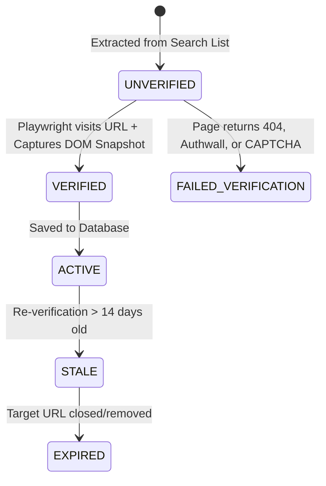

# BrowserPilot — Production Implementation Specification & Engineering Execution Blueprint

---

## 1. Implementation Strategy

### 1.1 Engineering Philosophy & Non-Negotiables
1. **Preserve Working Systems**: Do not perform greenfield rewrites. Retain the working Next.js 16.3.2 Turbopack setup, NextAuth.js JWT authentication, CDP 15 FPS screencast engine, and Turso/LibSQL database client.
2. **Deterministic-First Execution**: Use deterministic parsers, regular expressions, and bounded mathematical formulas for scoring, ranking, and deduplication. Reserve LLM calls exclusively for ambiguous intent interpretation and structured schema extraction.
3. **Strict Bounded Concurrency**: Never spawn unbounded browser instances or network requests. All multi-source searches run through capped `Promise.allSettled()` pools with individual timeouts.
4. **Relational Opportunity Persistence**: Move away from ephemeral stringified JSON in `jobs.result` by introducing canonical `Opportunity` and `SavedOpportunity` entities with deduplication fingerprints.
5. **No Blind AWS Over-Provisioning**: Maintain the single-process Next.js execution model for the initial MVP while structuring worker modules for seamless extraction to AWS ECS Fargate tasks via BullMQ / SQS when load dictates.

---

## 2. First Production Milestone (MVP Target Scope)

### 2.1 What Milestone 1 Delivers (IN-SCOPE)
* **Goal**: A student or early-career developer inputs a natural-language query (e.g., *"Find remote React internships for 2025/2026 graduates in India at startups"*), and BrowserPilot:
  1. Parses the query into a structured `SearchIntent` object with extracted filters (role, skills, batch, work mode).
  2. Executes a bounded parallel crawl across **LinkedIn Public Jobs**, **Y Combinator (WorkAtAStartup)**, and **Indeed**.
  3. Extracts structured opportunity fields without hallucinating missing data.
  4. Filters duplicates using a deterministic fuzzy fingerprint (`company_title_location`).
  5. Captures verified viewport screenshots (0% white screens via DOM hydration guards).
  6. Persists canonical opportunities into the database.
  7. Displays an interactive **Verified Job Dossier Deck** with 1-click external apply links, screenshot zoom, and persistent bookmarking.

### 2.2 What Milestone 1 Explicitly Excludes (OUT-OF-SCOPE)
* ❌ Automated job application submission bots (auto-filling external forms).
* ❌ Stripe / LemonSqueezy payment gateways and active credit billing.
* ❌ Multi-container Kubernetes / microservice service mesh.
* ❌ Vector database embeddings / OpenSearch clusters.
* ❌ Resume parsing and automated PDF uploads.

---

## 3. Architecture Reconciliation: Current vs. Target

| Architectural Area | Current State in Repository | Target State (Milestone 1 & Beyond) | Required Engineering Change |
|---|---|---|---|
| **Search Orchestration** | Sequential crawl across 1–2 sources via `for...of` in `lib/scraper/multiSearch.ts` | Bounded parallel search fan-out across 3+ providers with timeout ceilings | Refactor `lib/scraper/multiSearch.ts` to use `SearchProvider` interface and `Promise.allSettled` |
| **Search Intent** | Free-form natural language passed directly to planner | Structured `SearchIntent` schema with role, skills, batch, and work mode | Create `lib/ai/intentParser.ts` with strict Zod validation schema |
| **Data Persistence** | Scraped jobs dumped as ephemeral JSON strings in `jobs.result` | Canonical `Opportunity` table with unique fingerprint and `SavedOpportunity` table | Add new tables in `prisma/schema.prisma` and build `lib/db/opportunities.ts` |
| **Deduplication** | In-memory line filtering in `lib/scraper/normalizer.ts` | 3-tier cascade: Canonical URL $\to$ Fuzzy Fingerprint $\to$ Levenshtein title matching | Enhance `lib/scraper/normalizer.ts` with MD5 hashing and database upsert guards |
| **Verification & Evidence** | Viewport screenshot saved as loose file; verification is a binary flag | Opportunity linked to `screenshotPath`, `lastVerifiedAt`, and verified status | Add verification state machine and attach artifact URLs directly to `Opportunity` |
| **Ranking** | Unordered list returned from DOM extraction | Deterministic 100-point formula ($S_{\text{role}} + S_{\text{skills}} + S_{\text{mode}} + S_{\text{freshness}} + S_{\text{verified}}$) | Create `lib/scraper/ranker.ts` |
| **Browser Execution** | Direct in-process Playwright inside Next.js serverless route | In-process for MVP; abstracted via queue interface for Fargate worker extraction | Ensure `worker/executor.ts` consumes standardized payload compatible with BullMQ |
| **Credit Ledger** | No ledger (Gemini BYOK or server env key only) | Structured, immutable `CreditAccount` and `CreditTransaction` schema design | Design schema and internal cost calculation engine (do not expose billing UI yet) |
| **AWS Target** | Single container `Dockerfile.app` | CloudFront $\to$ ALB $\to$ ECS Fargate Web + ECS Fargate Workers + S3 + RDS/Turso | Provide validated Terraform / CDK configuration for Fargate deployment |

---

## 4. Final Domain Model (Milestone 1)

```prisma
// ============================================================================
// BROWSERPILOT CANONICAL DOMAIN SCHEMA
// Location: prisma/schema.prisma
// ============================================================================

model User {
  id           String             @id @default(cuid())
  name         String?
  email        String             @unique
  passwordHash String
  geminiApiKey String?
  createdAt    DateTime           @default(now())
  updatedAt    DateTime           @default(now()) @updatedAt

  jobs         Job[]
  searches     Search[]
  savedJobs    SavedOpportunity[]

  @@map("users")
}

model Search {
  id             String         @id @default(cuid())
  userId         String?
  rawQuery       String
  intentType     String         @default("JOB_SEARCH_GENERAL") // JOB_SEARCH_INTERNSHIP, ENTRY_LEVEL, STARTUP
  parsedRole     String?
  parsedSkills   String         @default("[]") // JSON string array
  parsedLocation String?
  parsedWorkMode String         @default("ANY") // REMOTE, HYBRID, ON_SITE, ANY
  targetGradYear Int?
  status         String         @default("COMPLETED") // PENDING, COMPLETED, FAILED
  totalFound     Int            @default(0)
  createdAt      DateTime       @default(now())

  user           User?          @relation(fields: [userId], references: [id], onDelete: SetNull)
  results        SearchResult[]

  @@index([userId])
  @@index([createdAt])
  @@map("searches")
}

model Opportunity {
  id              String             @id @default(cuid())
  fingerprint     String             @unique // md5(company_title_location)
  title           String
  companyName     String
  location        String
  workMode        String             @default("ANY") // REMOTE, HYBRID, ON_SITE
  experienceLevel String             @default("ENTRY_LEVEL") // INTERN, ENTRY_LEVEL, MID
  opportunityType String             @default("FULL_TIME") // INTERNSHIP, FULL_TIME, CONTRACT
  salaryMin       Float?
  salaryMax       Float?
  salaryCurrency  String?            @default("USD")
  description     String
  requirements    String             @default("[]") // JSON string array of clean bullet points
  skills          String             @default("[]") // JSON string array of detected tech stack
  applyUrl        String
  sourcePlatform  String             // LinkedIn, YC, Indeed, Company
  screenshotPath  String?
  firstSeenAt     DateTime           @default(now())
  lastVerifiedAt  DateTime           @default(now())
  status          String             @default("ACTIVE") // ACTIVE, STALE, EXPIRED

  searchResults   SearchResult[]
  savedByUsers    SavedOpportunity[]

  @@index([sourcePlatform])
  @@index([workMode])
  @@index([experienceLevel])
  @@index([lastVerifiedAt])
  @@map("opportunities")
}

model SearchResult {
  id            String      @id @default(cuid())
  searchId      String
  opportunityId String
  matchScore    Float       @default(0.0) // 0.0 to 100.0
  rankPosition  Int         @default(0)
  createdAt     DateTime    @default(now())

  search        Search      @relation(fields: [searchId], references: [id], onDelete: Cascade)
  opportunity   Opportunity @relation(fields: [opportunityId], references: [id], onDelete: Cascade)

  @@unique([searchId, opportunityId])
  @@index([searchId, rankPosition])
  @@map("search_results")
}

model SavedOpportunity {
  id            String      @id @default(cuid())
  userId        String
  opportunityId String
  notes         String?
  createdAt     DateTime    @default(now())

  user          User        @relation(fields: [userId], references: [id], onDelete: Cascade)
  opportunity   Opportunity @relation(fields: [opportunityId], references: [id], onDelete: Cascade)

  @@unique([userId, opportunityId])
  @@map("saved_opportunities")
}
```

---

## 5. Database Implementation Specification

### 5.1 Canonical Identity & Fingerprint Generation
To prevent identical job postings from duplicating across searches or sources, every opportunity generates a deterministic fingerprint:

$$\text{rawString} = \text{clean}(\text{company}) + \text{"\_"} + \text{clean}(\text{title}) + \text{"\_"} + \text{clean}(\text{location})[:10]$$
$$\text{fingerprint} = \text{crypto.createHash("md5").update(rawString).digest("hex")}$$

### 5.2 Upsert Logic (`lib/db/opportunities.ts`)
```typescript
export async function upsertOpportunity(data: Prisma.OpportunityCreateInput): Promise<Opportunity> {
  return await prisma.opportunity.upsert({
    where: { fingerprint: data.fingerprint },
    update: {
      lastVerifiedAt: new Date(),
      status: "ACTIVE",
      description: data.description || undefined,
      requirements: data.requirements || undefined,
      applyUrl: data.applyUrl || undefined,
      screenshotPath: data.screenshotPath || undefined,
    },
    create: data,
  });
}
```

---

## 6. API Specification

### 6.1 `POST /api/search`
* **Purpose**: Dispatches an autonomous multi-source opportunity search.
* **Authentication**: Optional (supports anonymous guest sessions and authenticated users).
* **Request Payload**:
```json
{
  "query": "Find remote AI internships for 2026 batch",
  "filters": {
    "workMode": "REMOTE",
    "experienceLevel": "INTERN",
    "targetGradYear": 2026
  },
  "maxResults": 10
}
```
* **Response (200 OK)**:
```json
{
  "searchId": "search_1787841029_abcd",
  "jobId": "job_1787841029_xyz",
  "status": "QUEUED",
  "intent": {
    "intentType": "JOB_SEARCH_INTERNSHIP",
    "role": "AI Engineer",
    "skills": ["Python", "Machine Learning"],
    "workMode": "REMOTE"
  }
}
```

### 6.2 `GET /api/opportunities/saved`
* **Purpose**: Fetches bookmarked opportunities for the authenticated user.
* **Authentication**: Required (`NextAuth` session).
* **Response (200 OK)**: Array of saved opportunities with full structured metadata and screenshot URLs.

### 6.3 `POST /api/opportunities/:id/save`
* **Purpose**: Toggles bookmarking of an opportunity for the authenticated user.
* **Authentication**: Required.
* **Response (200 OK)**: `{ "saved": true, "opportunityId": "..." }`.

---

## 7. Search Engine Implementation

```
lib/scraper/
├── searchOrchestrator.ts    # Central coordinator for multi-source execution
├── intentParser.ts          # Deterministic + LLM search criteria extractor
├── normalizer.ts            # Boilerplate pruner, MD5 fingerprint generator
├── ranker.ts                # Deterministic 100-point scoring algorithm
├── providers/
│   ├── baseProvider.ts      # Abstract SearchProvider interface
│   ├── linkedInProvider.ts  # LinkedIn Guest Job Search adapter
│   └── ycProvider.ts        # Y Combinator WorkAtAStartup adapter
```

---

## 8. Bounded Parallel Execution Engine

In `lib/scraper/searchOrchestrator.ts`, provider crawls execute via bounded concurrency:

```typescript
export async function executeParallelDiscovery(
  intent: SearchIntent,
  options: { maxConcurrency: number; timeoutMs: number }
): Promise<NormalizedJobItem[]> {
  const activeProviders = [linkedInProvider, ycProvider, indeedProvider].filter(p => p.supports(intent));
  
  const providerPromises = activeProviders.map(async (provider) => {
    try {
      const page = await browserPool.createSession({ jobId: `search_${provider.name}_${Date.now()}` });
      try {
        const candidates = await provider.harvestLinks(page.page, intent, 5);
        const detailedJobs: NormalizedJobItem[] = [];
        
        for (const candidate of candidates) {
          const detail = await provider.extractDetails(page.page, candidate.url);
          detailedJobs.push(normalizeJobRecord({ ...candidate, ...detail }, provider.name));
        }
        return detailedJobs;
      } finally {
        await page.close();
      }
    } catch (err) {
      console.warn(`[SearchOrchestrator] Provider ${provider.name} failed:`, err);
      return [];
    }
  });

  const results = await Promise.allSettled(providerPromises);
  const rawItems = results.flatMap(r => r.status === "fulfilled" ? r.value : []);
  
  // Deduplicate and Rank
  const deduplicated = deduplicateJobs(rawItems);
  return rankOpportunities(deduplicated, intent);
}
```

---

## 9. AI Implementation & Token Budget Matrix

| Pipeline Stage | Purpose | Model | Token Ceiling | Temperature | Deterministic Fallback |
|---|---|---|---|---|---|
| **Prompt Enhancement** | Transform vague queries to actionable blueprints | `gemini-2.5-flash` | 150 Tokens | 0.2 | Regex entity extractor |
| **Intent Extraction** | Parse role, skills, batch, and work mode | `gemini-2.5-flash` | 120 Tokens | 0.1 | Keyword matching dictionary |
| **Schema Inference** | Generate tabular extraction schema | `gemini-2.5-flash` | 200 Tokens | 0.1 | Standard Canonical Job Schema |
| **Structured Extraction** | Extract clean fields from HTML text | `gemini-2.5-flash` | 350 Tokens | 0.1 | Cheerio CSS tag extractor |
| **Answer Synthesis** | Markdown summary with citation links | `gemini-2.5-flash` | 300 Tokens | 0.2 | Template string formatter |

* **Total Token Budget per Search**: $\le 1,120\text{ Tokens}$ ($\approx \$0.00018\text{ per search}$).

---

## 10. Verification & Evidence State Machine



---

## 11. 3-Tier Deduplication Strategy

1. **Tier 1 — Exact Canonical URL**: Strip tracking query params.
2. **Tier 2 — Deterministic Fuzzy Fingerprint**: `md5(company + "_" + title + "_" + location[:10])`.
3. **Tier 3 — Levenshtein String Distance**: Merge items with title similarity ratio $\ge 0.88$.

---

## 12. Deterministic 100-Point Ranking Formula

$$\text{Score} = S_{\text{role}} (35) + S_{\text{skills}} (25) + S_{\text{workMode}} (15) + S_{\text{freshness}} (15) + S_{\text{verified}} (10)$$

---

## 13. Detailed Engineering Tasks (Task Breakdown)

### TASK-001: Persistent Opportunity Database Schema
* **Title**: Implement `Opportunity` and `SavedOpportunity` Prisma Models.
* **Objective**: Enable database persistence and unique fingerprint indexing for discovered jobs.
* **Files to Modify**: `prisma/schema.prisma`.
* **Files to Create**: `lib/db/opportunities.ts`.
* **Tests**: `tests/integration/opportunityDb.test.ts`.
* **Complexity**: Low.

### TASK-002: Pluggable Multi-Source Search Adapters
* **Title**: Build Search Provider Adapters for LinkedIn, YC, and Indeed.
* **Objective**: Implement parallel candidate harvesting across the top 3 tech job directories.
* **Files to Modify**: `lib/scraper/multiSearch.ts`.
* **Files to Create**: `lib/scraper/providers/linkedInProvider.ts`, `lib/scraper/providers/ycProvider.ts`, `lib/scraper/providers/indeedProvider.ts`.
* **Tests**: `tests/integration/multiSearch.test.ts`.
* **Complexity**: Medium.

### TASK-003: Deterministic 100-Point Ranker & Deduplicator
* **Title**: Implement Fuzzy Deduplication and 100-Point Scoring Engine.
* **Objective**: Merge cross-posted duplicates and rank opportunities by student relevance.
* **Files to Modify**: `lib/scraper/normalizer.ts`.
* **Files to Create**: `lib/scraper/ranker.ts`.
* **Tests**: `tests/unit/ranker.test.ts`, `tests/unit/deduplication.test.ts`.
* **Complexity**: Low.

### TASK-004: Interactive Saved Jobs & Dossier UI Enhancements
* **Title**: Implement 1-Click Bookmark and Full-Page Saved Opportunities UI.
* **Objective**: Allow users to save jobs and re-open them with zero token spend.
* **Files to Modify**: `components/result/job-dossier-deck.tsx`, `app/app/history/page.tsx`.
* **Files to Create**: `app/api/opportunities/[id]/save/route.ts`, `app/api/opportunities/saved/route.ts`.
* **Complexity**: Medium.

---

## 14. Final Execution Sequence Summary

```text
Milestone 1: Database Foundation & Schema Migration (TASK-001)
Milestone 2: Multi-Source Search Adapter Suite (TASK-002)
Milestone 3: Anti-Hallucination Deduplication & Ranker (TASK-003)
Milestone 4: Interactive Saved Jobs Workspace UI (TASK-004)
Milestone 5: End-to-End Verification & Test Suite Execution
```
