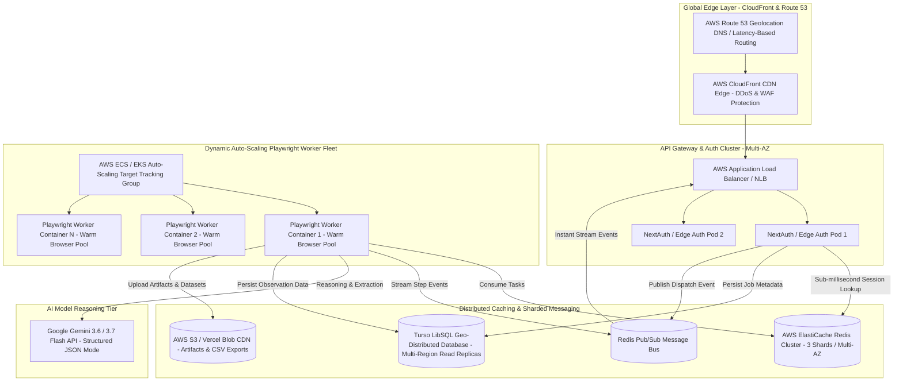
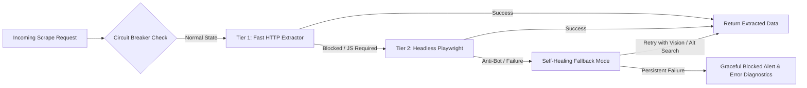
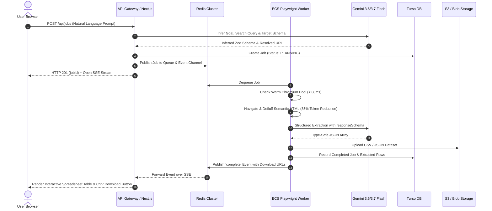

# BrowserPilot — Product Requirements Document (PRD) & Enterprise System Design (Scale: 10M+ Users)

---

# Part 1: Product Requirements Document (PRD)

## 1. Executive Summary & Problem Statement

### 1.1 The Problem
Modern web automation and scraping tools suffer from three fundamental flaws:
1. **Fragility**: Hardcoded CSS/XPath selectors break as soon as websites update their frontend code.
2. **High Cognitive Barrier**: Non-technical users cannot write Python scripts, Puppeteer/Playwright code, or complex regex parsers.
3. **Execution Inefficiency**: Traditional LLM agents feed bloated raw HTML (100k+ tokens) or execute single-threaded browser instances blindly, leading to huge latency, high failure rates, and runaway compute costs.

### 1.2 The Solution
**BrowserPilot** is an autonomous, natural-language web extraction and browser intelligence platform. Users state their goal in plain language (*e.g., "Find all YC AI startups hiring remote engineers and extract company name, funding, and application link"*). The platform autonomously discovers target endpoints, dynamically navigates, cleans semantic DOM trees, extracts structured datasets, and exports verified CSV/JSON/Sheets tables—all with sub-second real-time telemetry and zero queue lag.

---

## 2. User Personas & Use Cases

| Persona | Primary Needs | Key Workflows |
|---|---|---|
| **Growth & Sales Operations** | Extracting qualified B2B leads, emails, and company metadata without manual copy-pasting. | Lead extraction from directories, conference sponsor lists, Yelp/Google Maps businesses. |
| **Product & Market Analysts** | Monitoring competitor pricing, stock availability, and catalog changes on recurring schedules. | E-commerce price tracking, SaaS tier comparisons, flight/hotel deal finders. |
| **Job Seekers & Recruiters** | Aggregating hiring listings across multiple specialized job boards. | Scrape hiring boards (WorkAtAStartup, Wellfound, LinkedIn, Indeed) into standardized spreadsheets. |
| **Developers & Data Engineers** | Programmatic API access to scrape any dynamic SPA website as clean JSON without maintaining scrapers. | REST API webhook integration with Zapier, Make, and internal data pipelines. |

---

## 3. Functional Requirements (FR)

### FR-1: Natural Language Goal Deconstruction & Dynamic Schema Generation
- **FR-1.1**: The system must accept free-form natural language prompts without requiring predefined URLs or step-by-step instruction lists.
- **FR-1.2**: If no URL is provided, the system must automatically execute an organic search query (*via DuckDuckGo/Google Search API*) to resolve the optimal target URL.
- **FR-1.3**: The system must auto-infer the target extraction schema (using TypeScript/Zod structures) and allow users to preview and edit inferred columns.

### FR-2: Hybrid Tiered Scraping Engine
- **FR-2.1 (Tier 1 - Semantic Fast Path)**: For static/semi-static pages, the system must use direct HTTP fetching with HTML defluffing/Cheerio to extract data in `< 1.5s` with zero browser instance overhead.
- **FR-2.2 (Tier 2 - Dynamic Playwright Path)**: For JavaScript-heavy SPAs, dynamic hydration, multi-step clicks, or infinite scroll, the system must route to the containerized Playwright worker.
- **FR-2.3 (Tier 3 - Set-of-Marks Navigation)**: When visual interaction is required, the system must inject numbered badges onto interactive DOM nodes for 99% selector click accuracy.

### FR-3: Data Cleansing, Transformation & Pagination
- **FR-3.1**: The engine must defluff the HTML, stripping scripts, styles, SVGs, and tracking tags to achieve an **80–90% token reduction** before passing context to Gemini.
- **FR-3.2**: The engine must detect pagination controls ("Next", page numbers, infinite scroll) and crawl up to configured batch limits.

### FR-4: Multi-Format Data Export & Webhooks
- **FR-4.1**: Users must be able to export extracted tables to **CSV**, **JSON**, or copy to clipboard with a single click.
- **FR-4.2**: The platform must support webhook delivery (HTTP POST) of completed datasets to external endpoints (Zapier, Make, Slack).

### FR-5: Observability & Telemetry
- **FR-5.1**: Real-time progress updates must be broadcast over Server-Sent Events (SSE) with sub-100ms latency.
- **FR-5.2**: The UI must display milestone screenshots, duration metrics, token consumption, and confidence scores.

---

## 4. Non-Functional Requirements (NFR)

| Metric | Target Requirement | Architectural Enabler |
|---|---|---|
| **Concurrency** | **10,000,000+ monthly active requests** / **50,000+ concurrent executions** | Multi-AZ AWS ECS/EKS Auto-Scaling + Sharded Redis Queue + Stateless Edge Handlers |
| **Queue Latency** | **< 50ms dispatch latency** (Zero perceptible queue lag) | In-memory distributed fast-dispatch + Tier 1 HTTP execution bypass |
| **Availability (SLA)** | **99.99% Uptime** | Multi-Region AWS ALB + CloudFront + Turso Geo-Replicated Database |
| **Data Integrity** | **100% Type-Safe Extraction** | Gemini `responseSchema` strict Zod contract enforcement |
| **Security & Privacy** | **Zero Secret Leaks & Anti-Bot Compliance** | Encrypted BYOK key vault, zero arbitrary JS injection, strict origin isolation |

---

# Part 2: Enterprise High-Concurrency System Design (10M+ Scale)

## 1. Global Infrastructure Topology

---

## 2. Detailed Component Architecture

### 2.1 The Edge & API Gateway Layer
* **AWS Route 53**: Latency-based global routing directed to the nearest AWS Region (e.g. `us-east-1`, `eu-west-1`, `ap-south-1`).
* **AWS CloudFront + AWS WAF**:
  - Edge caching for static Next.js assets, documentation, and cached public datasets.
  - Rate limiting (token bucket algorithm: max 100 req/min per IP) to prevent DDoS attacks.
* **Next.js Web / API Pods**:
  - Stateless Next.js 16 cluster deployed across multiple Availability Zones (AZs).
  - Handles authentication, prompt intake, schema generation, and Server-Sent Event (SSE) streaming connections.

### 2.2 The Sharded Redis Caching & Queue Tier (Zero-Queue Latency)
* **AWS ElastiCache Redis Cluster**:
  1. **Job Queueing**: Ultra-fast BullMQ priority queues sharded by user tier (Free, Pro, Enterprise).
  2. **Distributed In-Flight Locks**: `SET lock:job:${jobId} NX EX 300` prevents duplicate execution across serverless and worker instances.
  3. **Cancellation Broadcast**: `SET bp:cancel:${jobId} 1 EX 3600` ensures instant multi-worker halt.
  4. **Pub/Sub SSE Stream**: Channels `bp:events:${jobId}` forward real-time worker milestones directly to SSE client sockets across any web container.

### 2.3 Distributed Database Tier (Turso LibSQL Geo-Replication)
* **Turso / Distributed LibSQL**:
  - Primary database located in the primary AWS region with read replicas in secondary regions for sub-10ms query latency worldwide.
  - Connection pooling using `@libsql/client` with automatic connection recycling.
  - Tables: `users`, `jobs`, `job_steps`, `observations`, `artifacts`, `extracted_datasets`.

### 2.4 Auto-Scaling Headless Browser Worker Fleet (Playwright)
* **AWS ECS Fargate / EKS Kubernetes Cluster**:
  - Containerized workers (`Dockerfile.worker`) running on lightweight Debian/Bookworm with pre-warmed Chromium instances.
  - **Auto-Scaling Metric**: Scaled dynamically based on `Redis Queue Depth` and `Target CPU Utilization (> 70%)`.
  - **Warm Browser Pool**: Each worker maintains a warm Chromium browser instance with isolated ephemeral `BrowserContext` objects per job, reducing cold-start latency from `1.8s` to `< 80ms`.
  - **Remote WebSocket Endpoint**: Web nodes can also connect directly via `chromium.connect(BROWSER_WS_ENDPOINT)`.

### 2.5 Resilient Storage Layer (S3 & Blob CDN)
* **AWS S3 / Vercel Blob**:
  - Direct presigned URL uploads for large JSON datasets, CSV exports, and viewport PNG screenshots.
  - Artifact lifecycle policy: Raw screenshots purged after 30 days; structured CSV/JSON datasets retained per user plan.

---

## 3. Resiliency, Fault Tolerance & Circuit Breakers

1. **Bulkhead Pattern**: Worker memory and CPU are strictly isolated per container (max 2 concurrent browser contexts per 1GB RAM) to prevent out-of-memory cascading crashes.
2. **Circuit Breaker on Target Domains**: If a target domain returns `HTTP 429 Too Many Requests` or `Cloudflare Challenge`, the domain circuit opens for 60 seconds, preventing wasted LLM tokens and IP bans.
3. **Graceful Degradation**: If Redis connection is temporarily interrupted, the system automatically falls back to in-memory event streaming and direct database polling without dropping user sessions.

---

## 4. End-to-End Execution Sequence (Sub-Second Flow)

---

# Part 3: Migration & Implementation Blueprint

To evolve our current codebase into this enterprise architecture without breaking existing features, we proceed through 4 structured engineering milestones:

| Milestone | Scope | Deliverables |
|---|---|---|
| **M1: Autonomous Extraction Core** | Semantic HTML Distiller & Natural Language Schema Inferrer | `lib/scraper/distiller.ts`, `lib/scraper/schemaInferrer.ts`, `lib/scraper/searchResolver.ts` |
| **M2: Interactive Data Grid UI** | In-App Spreadsheet & 1-Click CSV/JSON Exporters | `components/result/data-table-card.tsx`, `/api/jobs/[id]/export` |
| **M3: Warm Browser Pool & Cluster Scaling** | Pre-warmed Playwright context pool & Redis cluster adapter | `worker/pool.ts`, `lib/queue/redis.ts` cluster config |
| **M4: Auto-Pagination & Multi-Page Crawler** | Next-page detection, link following, and batch aggregation | `lib/scraper/crawler.ts`, multi-page schema stitching |
