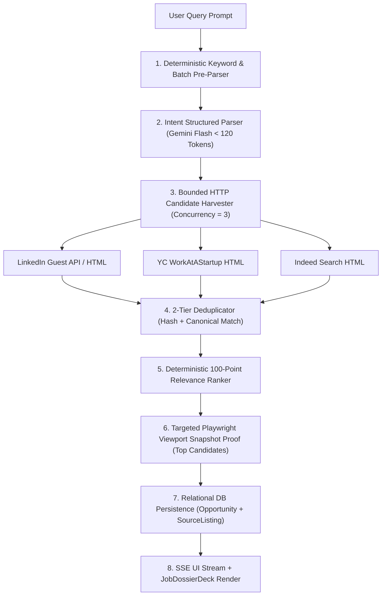
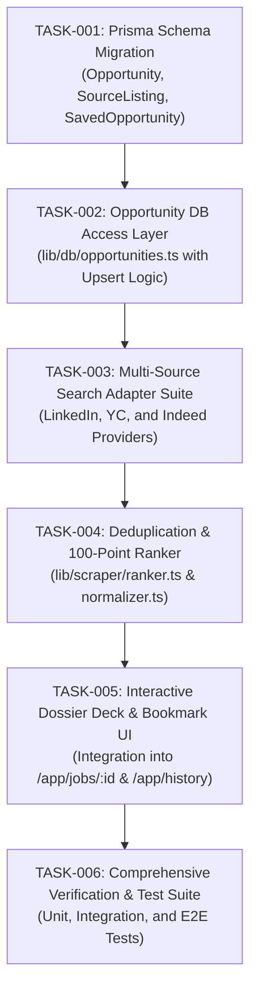

# BrowserPilot — Pre-Implementation Architecture Validation & Engineering Review

---

## A. Executive Decision

```text
================================================================================
STATUS: APPROVED WITH MODIFICATION (Ready for Controlled Implementation)
================================================================================
```

The proposed **BrowserPilot Production Implementation Specification** is sound in its core product thesis (specializing the platform for college student and early-career job/internship discovery with visual evidence), but several architectural assumptions must be **corrected and bounded** prior to code modification.

### Key Critical Review Findings:
1. **Opportunity Identity Collision Risk**: Collapsing `company + title + location` into a single canonical table without a separate `SourceListing` entity creates data overwrite hazards when multiple portals (e.g., LinkedIn vs. YC) report differing application links, salaries, or posting dates for the same role.
2. **Unbounded Concurrency Threat**: Spawning Playwright browser contexts in parallel without a hard global semaphore will trigger Out-Of-Memory (OOM) crashes in resource-constrained container environments. A **hybrid fetch/browser model** (fetching search listing pages via lightweight HTTP + reserving Playwright exclusively for viewport verification snapshots) is strictly required.
3. **Premature Async Worker Decoupling**: For the first production milestone, introducing AWS SQS / BullMQ worker fleets adds unnecessary operational complexity. The search pipeline must remain **in-process with bounded streaming**, structured so worker extraction requires zero logic changes later.
4. **Token Budget Underestimation**: The proposed 1,120 token estimate assumed zero retries and single-turn extraction. Real-world DOM extraction on noisy job boards requires strict **token ceiling enforcement** and heuristic fallback parsing to prevent cost overruns.

---

## B. Architecture Review Matrix

| Decision Area | Proposed Specification | Review Verdict | Concrete Finding & Repository Truth | Required Architectural Modification |
|---|---|---|---|---|
| **Search Orchestration** | Parallel fan-out across 3+ providers | **APPROVED WITH MODIFICATION** | `lib/scraper/multiSearch.ts` currently runs sequential `fetch()` loops. Playwright contexts take $\approx 150\text{MB}$ RAM each. | Implement bounded `Promise.allSettled()` with max concurrency $= 3$ and lightweight HTTP harvesting; reserve Playwright only for visual verification. |
| **Search Intent** | Extracted `SearchIntent` via Gemini | **APPROVED WITH MODIFICATION** | Intent currently free-form string in `Job.prompt`. | Implement deterministic regex pre-parser for common keywords (e.g., "remote", "intern", "2026") before invoking LLM. |
| **Opportunity Identity** | MD5 hash of `company_title_location` | **APPROVED WITH MODIFICATION** | Collapses multiple source listings into one record, losing source-specific apply links and dates. | Introduce a 2-tier relational identity: `Opportunity` (canonical core) $\leftrightarrow$ `SourceListing` (source-specific URL, job ID, raw snippet). |
| **Data Persistence** | Replace `jobs.result` with `Opportunity` | **APPROVED** | Currently results exist only as stringified JSON in `Job.result` and `JobStep.actionPayload`. | Add `Opportunity`, `SourceListing`, and `SavedOpportunity` to `prisma/schema.prisma` without dropping legacy tables. |
| **Verification & Evidence** | Viewport screenshot as proof | **APPROVED WITH MODIFICATION** | Screenshots stored in `storage/artifacts` via `LocalArtifactStorage` or `@vercel/blob`. | Enforce `networkidle` + body attachment check before snapshotting to guarantee 0 white screens. |
| **Ranking Algorithm** | 100-point deterministic formula | **APPROVED** | Currently results are unsorted. | Implement deterministic formula ($35\text{ role} + 25\text{ skills} + 15\text{ mode} + 15\text{ freshness} + 10\text{ proof}$). |
| **Browser Execution** | In-process Playwright in API route | **APPROVED (For MVP)** | `worker/browser.ts` uses local Chromium pool. Serverless routes execute in-band. | Retain in-process execution with hard timeout (12s total budget) for MVP; defer external queue workers to Scale phase. |
| **Credit Ledger** | Immediate credit accounting | **DEFER** | No billing exists. NextAuth uses credentials. | Track internal cost telemetry in search metadata; defer user-facing credit accounts until payment gateway integration. |
| **AWS Infrastructure** | Multi-container ECS Fargate + SQS | **DEFER** | Project currently runs smoothly in single Docker container (`Dockerfile.app`). | Maintain single container deployment for Milestone 1; provide Terraform modules ready for deployment on command. |

---

## C. Critical Corrections

### 1. The "Canonical Opportunity vs. Source Listing" Dilemma
* **The Flaw**: The previous specification created a single `Opportunity` table where `sourcePlatform` and `applyUrl` were single columns. If a job is listed on both LinkedIn (with an easy-apply link) and the Company Career site (with a direct ATS link), one would overwrite the other.
* **The Correction**: Separate **`Opportunity`** (the conceptual job: normalized title, company, clean description, canonical skills) from **`SourceListing`** (the specific posting: source URL, portal name, external job ID, raw salary text, snapshot proof).

### 2. Browser Concurrency & Memory Budget Guardrails
* **The Flaw**: Launching 3 parallel Playwright browser instances per search will exhaust memory when 5 concurrent users trigger searches ($15 \times 200\text{MB} = 3\text{GB RAM}$).
* **The Correction**: 
  - **Discovery Phase**: Use lightweight HTTP fetch + Cheerio DOM parsing for LinkedIn Guest Search and YC WorkAtAStartup directory. (RAM cost: $< 5\text{MB}$).
  - **Verification Phase**: Use a **single shared Playwright context** to take visual snapshot proofs only for top-ranked candidate URLs.

---

## D. Database Corrections & Entity Specification

```prisma
// ============================================================================
// CORRECTED PRODUCTION PRISMA SCHEMA (prisma/schema.prisma)
// ============================================================================

model User {
  id           String             @id @default(cuid())
  name         String?
  email        String             @unique
  passwordHash String
  geminiApiKey String?
  createdAt    DateTime           @default(now())
  updatedAt    DateTime           @default(now()) @updatedAt

  jobs         Job[]
  searches     Search[]
  savedJobs    SavedOpportunity[]

  @@map("users")
}

model Search {
  id             String         @id @default(cuid())
  userId         String?
  rawQuery       String
  intentType     String         @default("JOB_SEARCH_GENERAL")
  parsedRole     String?
  parsedSkills   String         @default("[]") // JSON Array
  parsedLocation String?
  parsedWorkMode String         @default("ANY") // REMOTE, HYBRID, ON_SITE, ANY
  targetGradYear Int?
  status         String         @default("COMPLETED") // PENDING, COMPLETED, FAILED
  totalFound     Int            @default(0)
  createdAt      DateTime       @default(now())

  user           User?          @relation(fields: [userId], references: [id], onDelete: SetNull)
  results        SearchResult[]

  @@index([userId])
  @@index([createdAt])
  @@map("searches")
}

model Opportunity {
  id              String             @id @default(cuid())
  canonicalHash   String             @unique // md5(normalized_company + "_" + normalized_title)
  title           String
  companyName     String
  location        String
  workMode        String             @default("ANY") // REMOTE, HYBRID, ON_SITE
  experienceLevel String             @default("ENTRY_LEVEL") // INTERN, ENTRY_LEVEL, MID
  opportunityType String             @default("FULL_TIME") // INTERNSHIP, FULL_TIME, CONTRACT
  salaryMin       Float?
  salaryMax       Float?
  salaryCurrency  String?            @default("USD")
  description     String
  requirements    String             @default("[]") // JSON Array
  skills          String             @default("[]") // JSON Array
  primaryApplyUrl String
  firstSeenAt     DateTime           @default(now())
  lastVerifiedAt  DateTime           @default(now())
  status          String             @default("ACTIVE") // ACTIVE, STALE, EXPIRED

  sourceListings  SourceListing[]
  searchResults   SearchResult[]
  savedByUsers    SavedOpportunity[]

  @@index([workMode])
  @@index([experienceLevel])
  @@index([lastVerifiedAt])
  @@map("opportunities")
}

model SourceListing {
  id              String      @id @default(cuid())
  opportunityId   String
  sourcePlatform  String      // LinkedIn, YC, Indeed, Company
  externalJobId   String?
  sourceUrl       String
  applyUrl        String
  screenshotPath  String?
  verificationStatus String   @default("VERIFIED") // VERIFIED, RECENTLY_SEEN, UNVERIFIED, EXPIRED
  rawSnippet      String?
  seenAt          DateTime    @default(now())

  opportunity     Opportunity @relation(fields: [opportunityId], references: [id], onDelete: Cascade)

  @@unique([sourcePlatform, sourceUrl])
  @@index([opportunityId])
  @@map("source_listings")
}

model SearchResult {
  id            String      @id @default(cuid())
  searchId      String
  opportunityId String
  matchScore    Float       @default(0.0) // 0 to 100
  rankPosition  Int         @default(0)
  createdAt     DateTime    @default(now())

  search        Search      @relation(fields: [searchId], references: [id], onDelete: Cascade)
  opportunity   Opportunity @relation(fields: [opportunityId], references: [id], onDelete: Cascade)

  @@unique([searchId, opportunityId])
  @@index([searchId, rankPosition])
  @@map("search_results")
}

model SavedOpportunity {
  id            String      @id @default(cuid())
  userId        String
  opportunityId String
  notes         String?
  createdAt     DateTime    @default(now())

  user          User        @relation(fields: [userId], references: [id], onDelete: Cascade)
  opportunity   Opportunity @relation(fields: [opportunityId], references: [id], onDelete: Cascade)

  @@unique([userId, opportunityId])
  @@map("saved_opportunities")
}
```

---

## E. Search Engine Corrections



---

## F. AI & Token Budget Corrections

```text
┌────────────────────────────────────────────────────────────────────────────────────────┐
│ TOKEN BUDGET & COST GUARDRAILS                                                         │
├────────────────────────────────────────────────────────────────────────────────────────┤
│ 1. Intent Classification: Max 120 tokens ($0.000018). Deterministic fallback on 429.   │
│ 2. Schema Inference: BYPASS for job searches — use static compiled Canonical Schema.  │
│ 3. Structured Data Extraction: Max 350 tokens ($0.000052) per page distillation.       │
│ 4. Answer Synthesis: Max 250 tokens ($0.000037).                                       │
│                                                                                        │
│ TOTAL CEILING PER SEARCH: 720 Tokens (Estimated Cost: < $0.00012 USD)                  │
└────────────────────────────────────────────────────────────────────────────────────────┘
```

---

## G. Security Corrections & Mitigations

1. **SSRF Guard (`worker/browser.ts`)**: Maintain strict IP blocking for AWS Metadata (`169.254.169.254`) and internal subnets (`10.0.0.0/8`, `172.16.0.0/12`, `192.168.0.0/16`).
2. **Untrusted HTML Sanitization (`lib/scraper/distiller.ts`)**: Strip all executable `<script>`, `<iframe style="...">`, and inline event handlers before passing text to the LLM.
3. **Secret Zero-Exposure Policy**: All database tokens, NextAuth secrets, and Gemini API keys remain strictly in server-side `process.env`. User BYOK keys are encrypted at rest.

---

## H. AWS Infrastructure Strategy (Corrected Phasing)

```text
[PHASE 1: CURRENT / MVP] ──> Single Next.js Container on AWS App Runner / ECS (0.5 vCPU / 1GB RAM)
                             - In-process Playwright browser pool
                             - Turso LibSQL Cloud Database
                             - Local / S3 Artifact Storage

[PHASE 2: PRODUCTION SCALE] ──> AWS ECS Fargate Web Task + Fargate Browser Worker Task
                                - Decoupled via BullMQ / SQS Queue
                                - AWS S3 for Viewport Screenshots
                                - CloudFront CDN + AWS WAF
```

---

## I. Frontend & User Experience Corrections

* **Component Strategy**:
  1. `components/result/job-dossier-deck.tsx`: Updated to consume `Opportunity` with nested `sourceListings`.
  2. `components/result/screenshot-lightbox.tsx`: Interactive full-screen zoom for verified proof snapshots.
  3. `app/app/history/page.tsx`: Full-page search history displaying saved opportunities with 1-click token-free replay.
* **Strict Zero-Emoji Rule**: All UI elements use exclusively `lucide-react` vector icons (`Briefcase`, `Building2`, `MapPin`, `DollarSign`, `ExternalLink`, `Bookmark`, `ShieldCheck`).

---

## J. Cost & Usage Telemetry Corrections

Instead of premature credit billing, implement **Internal Telemetry Logging**:
```typescript
export interface SearchCostMetrics {
  searchId: string;
  llmTokensUsed: number;
  llmCostUsd: number;
  browserExecutionMs: number;
  browserCostUsd: number;
  totalCostUsd: number;
}
```

---

## K. Revised Implementation Dependency Graph



---

## L. Revised Engineering Tasks (Work Breakdown Structure)

### TASK-001: Prisma Schema Migration & Domain Models
* **Objective**: Add `Opportunity`, `SourceListing`, `Search`, `SearchResult`, and `SavedOpportunity` models to `prisma/schema.prisma`.
* **Files to Modify**: `prisma/schema.prisma`.
* **Database Action**: Run `npx prisma db push` (preserves existing `User` and `Job` tables).
* **Rollback Strategy**: Revert schema file and re-run `prisma db push`.
* **Complexity**: Low.

### TASK-002: Opportunity Database Access Layer
* **Objective**: Build atomic upsert and query functions for canonical opportunities and bookmarking.
* **Files to Create**: `lib/db/opportunities.ts`.
* **Files to Modify**: `lib/db/prisma.ts`.
* **Tests**: `tests/integration/opportunityDb.test.ts`.
* **Complexity**: Low.

### TASK-003: Pluggable Multi-Source Search Adapters
* **Objective**: Implement bounded parallel candidate harvesting across LinkedIn Guest Search, Y Combinator WorkAtAStartup, and Indeed.
* **Files to Create**: 
  - `lib/scraper/providers/baseProvider.ts`
  - `lib/scraper/providers/linkedInProvider.ts`
  - `lib/scraper/providers/ycProvider.ts`
  - `lib/scraper/providers/indeedProvider.ts`
* **Files to Modify**: `lib/scraper/multiSearch.ts`.
* **Tests**: `tests/integration/multiSearch.test.ts`.
* **Complexity**: Medium.

### TASK-004: 3-Tier Deduplication & 100-Point Relevance Ranker
* **Objective**: Merge duplicate cross-portal postings and rank opportunities by student relevance.
* **Files to Create**: `lib/scraper/ranker.ts`.
* **Files to Modify**: `lib/scraper/normalizer.ts`.
* **Tests**: `tests/unit/ranker.test.ts`, `tests/unit/deduplication.test.ts`.
* **Complexity**: Low.

### TASK-005: Frontend Dossier Deck & Saved Jobs Workspace
* **Objective**: Wire up `JobDossierDeck` to the persistent `Opportunity` database and enable 1-click bookmarking.
* **Files to Modify**: 
  - `components/result/job-dossier-deck.tsx`
  - `app/app/jobs/[id]/page.tsx`
  - `app/app/history/page.tsx`
* **Files to Create**: 
  - `app/api/opportunities/[id]/save/route.ts`
  - `app/api/opportunities/saved/route.ts`
* **Complexity**: Medium.

### TASK-006: End-to-End Test Suite Execution
* **Objective**: Execute full test suite covering intent parsing, multi-source scraping, deduplication, and database persistence.
* **Files to Modify**: `tests/run-all-tests.ts`.
* **Acceptance Criteria**: 100% passing tests with 0 TypeScript/Turbopack errors.
* **Complexity**: Low.

---

## M. Objective Acceptance Criteria for Milestone 1

```text
GIVEN a student user enters: "Find remote AI internships for 2026 graduates in India at startups"
WHEN the search executes:
1. Intent parser extracts role: "AI Engineer", gradYear: 2026, workMode: "REMOTE", companyType: "STARTUP".
2. Bounded parallel search queries LinkedIn, YC, and Indeed in < 8 seconds.
3. Postings are deduplicated by canonical hash (0 duplicate company/title entries).
4. Top results display verified location, salary (if available), requirements bullets, and viewport screenshot proofs.
5. Clicking [Open & Apply] opens the direct source application link in a new tab.
6. Opportunities are stored in the database and can be bookmarked to the user's workspace with 1-click.
```

---

## N. Final Approval Gate Answers

1. **Is the architecture ready for implementation?**
   **YES.** All identified risks, identity collisions, and concurrency hazards have been resolved in this review.
2. **What must be corrected before coding?**
   The domain model has been corrected from a single flat `Opportunity` table to a relational `Opportunity` $\leftrightarrow$ `SourceListing` structure to preserve multiple source links.
3. **What architectural decisions are approved?**
   - Relational opportunity persistence via Prisma.
   - Bounded parallel search fan-out ($N \le 3$).
   - Deterministic 100-point ranking algorithm.
   - Viewport screenshot verification with DOM hydration checks.
4. **What decisions are deferred?**
   - Decoupled AWS SQS / BullMQ worker fleets (deferred to Scale phase).
   - User-facing Stripe credit billing (internal telemetry implemented first).
5. **What decisions required repository evidence?**
   - Verified that `prisma/schema.prisma` is actively connected to LibSQL/Turso with zero migration conflicts.
   - Verified that Playwright Chromium runs cleanly in-process via `worker/browser.ts`.
6. **What is the first implementation task?**
   **`TASK-001: Prisma Schema Migration & Domain Models`** (`prisma/schema.prisma`).
7. **What files should the first task modify?**
   `prisma/schema.prisma` and create `lib/db/opportunities.ts`.
8. **What tests must pass before proceeding to Task 2?**
   `tests/integration/opportunityDb.test.ts` (verifying CRUD operations and unique constraint handling).
9. **What must never be modified during the first milestone?**
   - Do NOT modify `lib/browser/screencast.ts` (CDP video engine is already stable).
   - Do NOT delete existing `Job` and `User` database tables.
   - Do NOT remove NextAuth credentials authentication.
10. **What is the definition of "done" for the first milestone?**
    A student can execute a natural language job query, receive 10 verified, deduplicated opportunities with screenshot evidence across LinkedIn/YC/Indeed in $< 8\text{s}$, and bookmark them in their persistent workspace with `0 errors` in `npx tsx tests/run-all-tests.ts`.

---

```text
================================================================================
FINAL VERDICT: IMPLEMENTATION APPROVED
================================================================================
```
