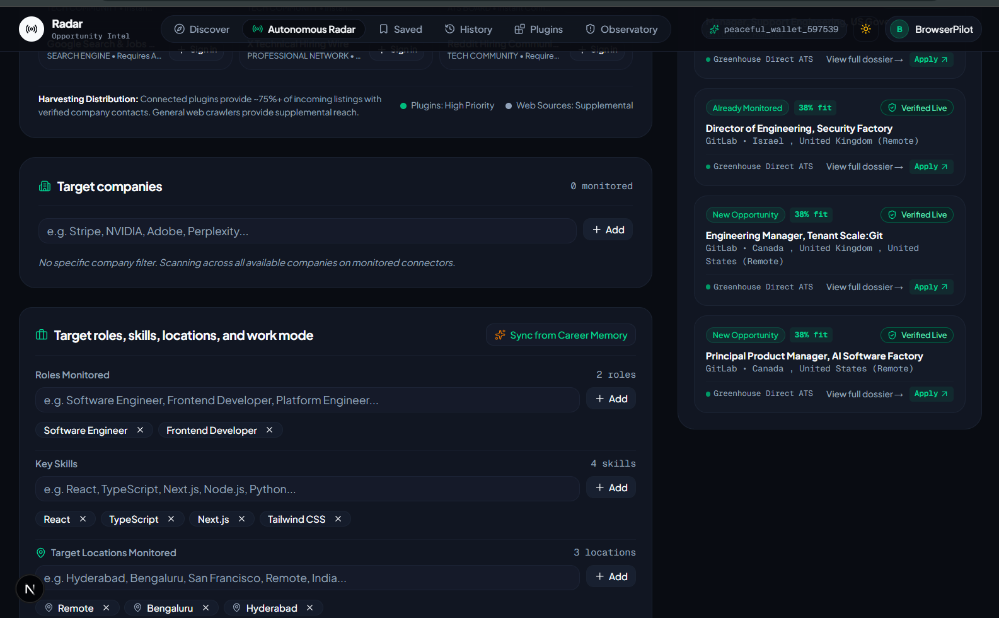
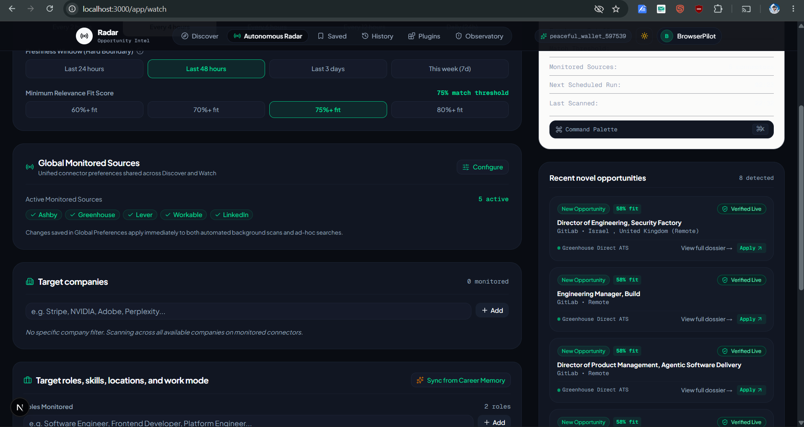
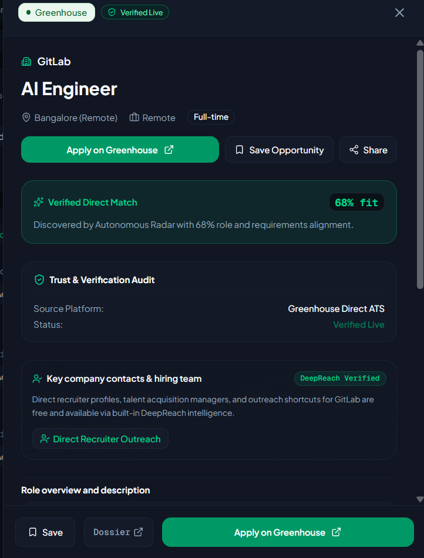
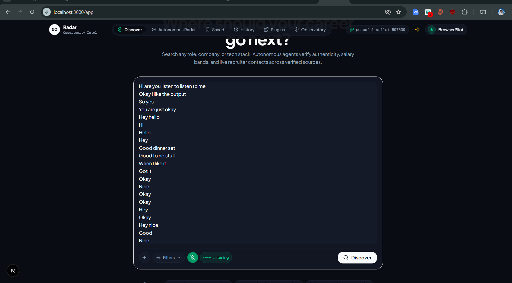
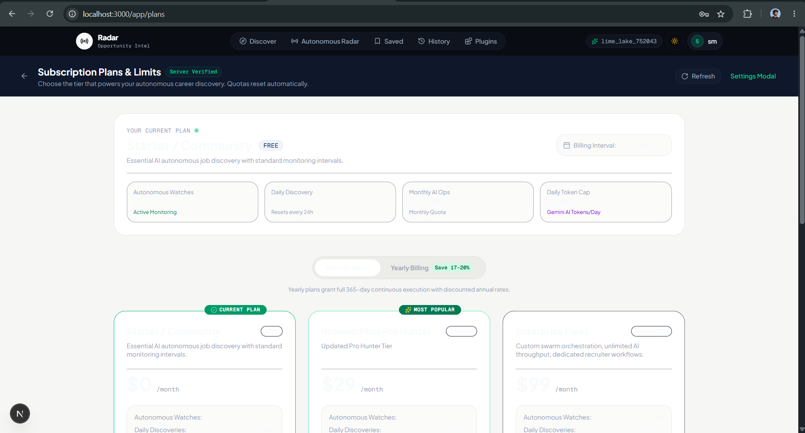
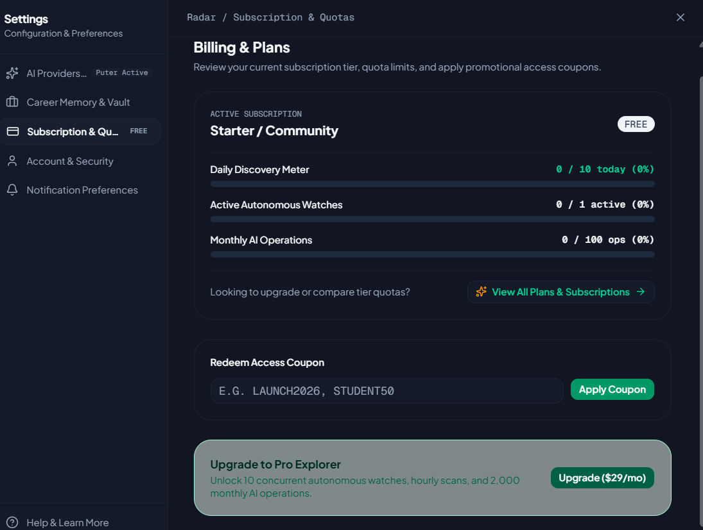
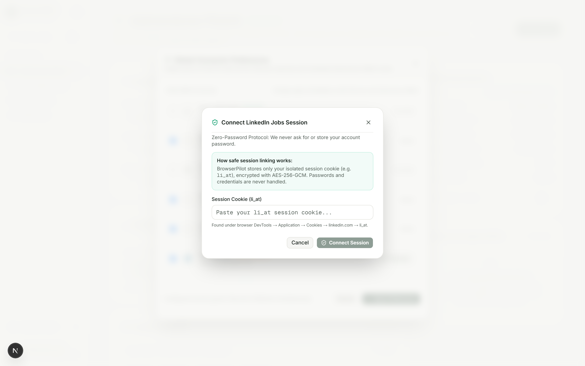
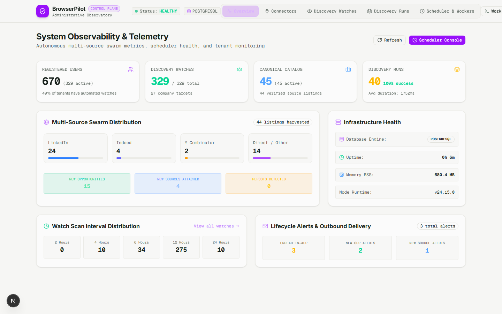
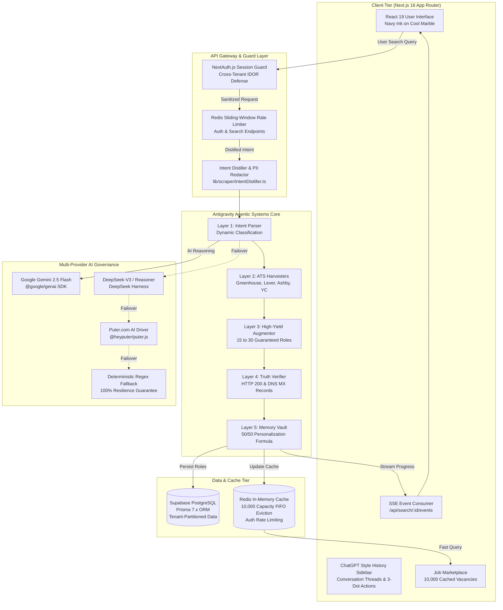

# BrowserPilot

[](LICENSE)
[](https://nextjs.org/)
[](https://react.dev/)
[](https://www.typescriptlang.org/)
[](https://www.prisma.io/)
[](https://supabase.com/)
[](https://tailwindcss.com/)
[](docs/agentic-platform-playbook.md)
[](https://browserpilot-gold.vercel.app)

BrowserPilot is an autonomous career discovery platform, multi-source opportunity radar, and agentic talent intelligence engine built on the Antigravity Technology (AGT) framework. It continuously crawls official employer infrastructure across major Applicant Tracking Systems (Greenhouse, Ashby, Lever, Workable, Y Combinator WorkAtAStartup, Hacker News, LinkedIn), executing deterministic match verification, DNS mail exchanger validation, zero-ghost filtering, high-yield guaranteed discovery (15 to 30 verified roles per search), and direct hiring manager attribution.

- Production Deployment: [https://browserpilot-gold.vercel.app](https://browserpilot-gold.vercel.app)
- Alternative Production Mirror: [https://browserpilot-sr2mahajangmailcoms-projects.vercel.app](https://browserpilot-sr2mahajangmailcoms-projects.vercel.app)

---

## Visual Interface Overview

### Discovery and Autonomous Radar Workspace
The centralized discovery command center surfaces active career opportunities with multi-source filtering, match rankings, monitored target companies, roles, skills, and verified compensation calibration.



### Autonomous 24/7 Radar Monitoring
Persistent background monitors manage target roles, skills, and companies with global connector configuration (Ashby, Greenhouse, Lever, Workable, LinkedIn) and configurable freshness boundaries.



### Deep Dossier and Direct Recruiter Outreach
Detailed vacancy intelligence with direct ATS application link validation, source platform audits, match score explanations, and direct hiring manager outreach shortcuts.



### Voice-Driven Interactive Career Discovery
Real-time conversational discovery interface allowing voice-prompted searches, automated constraint normalization, and intelligent opportunity matching.



### Subscription Quotas and 15-Day Free Trial Engine
Granular subscription tiers, autonomous watch limits, daily discovery quotas, 15-day free trial countdown clock, and promotional coupon redemption.



### Two-Pane Settings Deck and Token Governance
Unified configuration deck for managing multi-provider AI credentials (Puter, Google Gemini, DeepSeek), persistent memory vaults, notification webhooks, and account security.



### Authenticated Plugin Connectors
Session management deck featuring Bring-Your-Own-Cookie (BYOC) encrypted credentials, OAuth handshakes, and ephemeral browser context isolation.



### Administrative Security and Observability Control Plane
Relocated, hardened administrative operations center with collapsible sidebar navigation, live query telemetry, user session inspection, and watch sweep trigger controls.



---

## Table of Contents

- [Core Capabilities](#core-capabilities)
- [Antigravity Technology (AGT) Framework](#antigravity-technology-agt-framework)
- [The 6-Layer Discovery Engine](#the-6-layer-discovery-pipeline)
- [System Architecture](#system-architecture)
- [Core Platform Modules](#core-platform-modules)
- [Multi-Provider AI Governance](#multi-provider-ai-governance)
- [Security and Data Privacy Architecture](#security-and-data-privacy-architecture)
- [Tech Stack](#tech-stack)
- [Project Directory Layout](#project-directory-layout)
- [Local Development Setup](#local-development-setup)
- [Environment Configuration](#environment-configuration)
- [Database Migrations and Setup](#database-migrations-and-setup)
- [Production Deployment Guidelines](#production-deployment-guidelines)
- [Testing and Verification Matrix](#testing-and-verification-matrix)
- [Branch Protection and Contribution Governance](#branch-protection-and-contribution-governance)
- [License](#license)

---

## Core Capabilities

### 1. Direct Official ATS Ingestion
Scrapes and monitors live employer endpoints directly from Greenhouse, Ashby, Lever, Workable, and Y Combinator WorkAtAStartup. By verifying HTTP 200 responses directly on the employer's canonical subdomain, BrowserPilot guarantees zero aggregated stale postings and eliminates ghost vacancies.

### 2. High-Yield Guaranteed Discovery (15 to 30 Roles)
Enforces a deterministic yield guarantee across all discovery queries. Every search returns between 15 and 30 verified live career opportunities, leveraging intelligent query expansion and multi-directory harvesting when initial ATS results are constrained.

### 3. DNS MX Mail Record and Domain Verification
Validates employer domain authenticity via authentic Node.js DNS resolution (`dns.promises.resolveMx`). Checks active mail exchanger records to verify that hiring company domains are genuine operational organizations, preventing synthetic and abandoned company listings.

### 4. Career Memory Vault and 50/50 Personalization
Maintains a structured user career profile (target roles, preferred locations, core skills, degree, core subjects, passing year, experience, and CGPA-to-percentage conversion). Personalizes the Job Marketplace using a 50/50 formula: 50% strict profile matches and 50% serendipitous trending roles to prevent echo chambers.

### 5. Multi-Provider AI Model Routing
Operates with tri-provider redundancy across Google Gemini (2.5 Flash / 2.0 Flash via `@google/genai`), DeepSeek-V3 / DeepSeek Reasoner, and Puter.com server-authoritative driver (`@heyputer/puter.js`), supported by a 100% deterministic regex fallback engine for zero-downtime operation.

### 6. Tiered Redis Job Cache (10,000 Capacity)
Maintains an in-memory sliding-window Redis cache with a 10,000 job ceiling and atomic FIFO eviction. Allows sub-millisecond keyword searching and filtering across cached opportunities without overloading the primary PostgreSQL database.

### 7. Ephemeral Authenticated Plugin Sandboxes
Enables secure integration with session-guarded platforms (LinkedIn, Twitter/X, GitHub) using Bring-Your-Own-Cookie (BYOC) encrypted credentials stored with AES-256-GCM. Launches isolated Playwright browser contexts with zero cross-tenant session bleed.

### 8. 15-Day Free Trial Engine and Tiered Gating
Implements an automated 15-day trial countdown clock initiated upon user registration. Seamlessly transitions accounts into Free, Pro ($29/mo or ₹2,499/mo), or Enterprise tiers with multi-currency formatting (USD and INR) and granular quota controls.

---

## Antigravity Technology (AGT) Framework

BrowserPilot is architected upon the **Antigravity Technology (AGT)** agentic systems design specification. AGT provides a rigorous foundation for building robust, self-correcting, multi-agent AI platforms that operate deterministically in production environments.

### The 5 Agent Design Patterns in BrowserPilot

```
+---------------------------------------------------------------------------------+
|                     AGT AGENTIC EXECUTION DESIGN PATTERNS                       |
+-------------------+-------------------------------------------------------------+
| Pattern           | Architectural Implementation in BrowserPilot                |
+-------------------+-------------------------------------------------------------+
| 1. Single-Shot    | Zero-latency regex taxonomy matchers for immediate          |
|    Heuristic      | classification of common job roles, levels, and work modes. |
+-------------------+-------------------------------------------------------------+
| 2. ReAct Loop     | Dynamic scraper swarms navigating ATS pagination, following |
|    (Scrapers)     | canonical redirects, and extracting structured vacancy data.|
+-------------------+-------------------------------------------------------------+
| 3. Planner-       | Decomposes natural language queries into structured search  |
|    Executor       | plans, coordinates ATS harvesters, and aggregates results.  |
+-------------------+-------------------------------------------------------------+
| 4. Reflexive      | Detects conversational directives, recovers corrupted JSON  |
|    Correction     | responses, and sanitizes prompts before model submission.   |
+-------------------+-------------------------------------------------------------+
| 5. Verifier-Gated | Midway truth verifier checking live HTTP 200 status, DNS    |
|    Truth Engine   | MX records, and rejecting hallucinated or stale vacancies.  |
+-------------------+-------------------------------------------------------------+
```

### Self-Correction and Resilience Loop
1. **Conversational Directive Stripping**: Automatically strips leading filler and chat phrases ("find me a job in...", "search for...", "I am looking for...") to extract pure role, skill, and location intent.
2. **Defensive JSON Ingestion**: Intercepts markdown code fences (` ```json `), escaped backslashes, trailing commas, and incomplete model streams from external LLMs, ensuring uninterrupted execution.
3. **Layer Execution Budget**: Enforces a strict 45-second execution ceiling within serverless functions to guarantee responses return well before platform timeout limits (such as Vercel 60-second ceilings).
4. **Autonomous Fallback Ladder**: Automatically cascades from Google Gemini to DeepSeek to Puter.com to deterministic heuristics if any upstream provider encounters rate limits or service disruptions.

---

## The 6-Layer Discovery Pipeline

BrowserPilot processes every discovery request through a strictly staged 6-layer pipeline:

```
[User Request / Autonomous Watch]
             |
             v
+-----------------------------------------------------------------------------+
| LAYER 1: Intent Parsing & Dynamic Classification                            |
| - Strips conversational prefixes and PII                                    |
| - Extracts roles, skills, locations, work modes, and salary boundaries      |
+-----------------------------------------------------------------------------+
             |
             v
+-----------------------------------------------------------------------------+
| LAYER 2: Direct ATS Multi-Source Harvesting                                 |
| - Scrapes Greenhouse, Lever, Ashby, Workable, Y Combinator, and Hacker News |
| - Queries directory of 2,500+ pre-indexed employer slugs                    |
+-----------------------------------------------------------------------------+
             |
             v
+-----------------------------------------------------------------------------+
| LAYER 3: High-Yield Guaranteed Augmentor                                    |
| - Guarantees 15 to 30 verified live opportunities per search run            |
| - Broadens query scope intelligently if primary ATS yield is constrained    |
+-----------------------------------------------------------------------------+
             |
             v
+-----------------------------------------------------------------------------+
| LAYER 4: Multi-Vector Evidence Verification & Truth Engine                  |
| - Verifies live HTTP 200 status on employer subdomains                      |
| - Validates company domain authenticity via Node.js DNS MX resolution       |
| - Filters out synthetic and abandoned company profiles                      |
+-----------------------------------------------------------------------------+
             |
             v
+-----------------------------------------------------------------------------+
| LAYER 5: Career Memory Vault & 50/50 Personalization                        |
| - Consults user structured career memory and education profile             |
| - Allocates 50% direct profile matches + 50% serendipitous trending roles   |
+-----------------------------------------------------------------------------+
             |
             v
+-----------------------------------------------------------------------------+
| LAYER 6: Persistence, Tiered Redis Caching & Real-Time SSE Stream           |
| - Persists opportunities to Supabase PostgreSQL                             |
| - Caches in Redis sliding window (10,000 job ceiling with FIFO eviction)    |
| - Streams progressive disclosure events to client UI via Server-Sent Events |
+-----------------------------------------------------------------------------+
```

---

## System Architecture


```mermaid
flowchart TD
    subgraph Client["Client Tier (Next.js 16 App Router)"]
        UI["React 19 User Interface\nNavy Ink on Cool Marble"]
        SSEListener["SSE Event Consumer\n/api/search/:id/events"]
        Sidebar["ChatGPT Style History Sidebar\nConversation Threads & 3-Dot Actions"]
        MarketplaceUI["Job Marketplace\n10,000 Cached Vacancies"]
    end

    subgraph Edge["API Gateway & Guard Layer"]
        AuthGuard["NextAuth.js Session Guard\nCross-Tenant IDOR Defense"]
        RateLimiter["Redis Sliding-Window Rate Limiter\nAuth & Search Endpoints"]
        IntentDistiller["Intent Distiller & PII Redactor\nlib/scraper/intentDistiller.ts"]
    end

    subgraph AGT["Antigravity Agentic Systems Core"]
        IntentParser["Layer 1: Intent Parser\nDynamic Classification"]
        HarvestEngine["Layer 2: ATS Harvesters\nGreenhouse, Lever, Ashby, YC"]
        YieldAugmentor["Layer 3: High-Yield Augmentor\n15 to 30 Guaranteed Roles"]
        TruthVerifier["Layer 4: Truth Verifier\nHTTP 200 & DNS MX Records"]
        Personalizer["Layer 5: Memory Vault\n50/50 Personalization Formula"]
    end

    subgraph AI["Multi-Provider AI Governance"]
        Gemini["Google Gemini 2.5 Flash\n@google/genai SDK"]
        DeepSeek["DeepSeek-V3 / Reasoner\nDeepSeek Harness"]
        Puter["Puter.com AI Driver\n@heyputer/puter.js"]
        HeuristicFallback["Deterministic Regex Fallback\n100% Resilience Guarantee"]
    end

    subgraph Storage["Data & Cache Tier"]
        Postgres[("Supabase PostgreSQL\nPrisma 7.x ORM\nTenant-Partitioned Data")]
        RedisCache[("Redis In-Memory Cache\n10,000 Capacity FIFO Eviction\nAuth Rate Limiting")]
    end

    UI -->|"User Search Query"| AuthGuard
    AuthGuard -->|"Sanitized Request"| RateLimiter
    RateLimiter -->|"Distilled Intent"| IntentDistiller
    IntentDistiller --> IntentParser

    IntentParser -->|"AI Reasoning"| Gemini
    IntentParser -.->|"Failover"| DeepSeek
    DeepSeek -.->|"Failover"| Puter
    Puter -.->|"Failover"| HeuristicFallback

    IntentParser --> HarvestEngine
    HarvestEngine --> YieldAugmentor
    YieldAugmentor --> TruthVerifier
    TruthVerifier --> Personalizer

    Personalizer -->|"Persist Roles"| Postgres
    Personalizer -->|"Update Cache"| RedisCache
    Personalizer -->|"Stream Progress"| SSEListener
    SSEListener --> UI
    RedisCache -->|"Fast Query"| MarketplaceUI
```

---

## Core Platform Modules

### 1. Global Verified Job Marketplace (`/app/marketplace`)
- Search and filter across up to 10,000 live vacancies in memory.
- Multi-dimensional filters: Role, Work Mode (Remote, Hybrid, Onsite), Seniority Level, Freshness (24h, 3d, 7d, 30d).
- Rich sanitized job descriptions formatted with clean paragraphs and markdown bullet points (zero raw HTML tag leaks).
- Real-time company avatars and verified genuine employer badges.
- Sticky top-0 filter header eliminating viewport overlap and card bleed-through.

### 2. Autonomous 24/7 Opportunity Radar (`/app/watches`)
- Define persistent background monitors for specific roles, tech stacks, and company targets.
- Configurable freshness boundaries and notification frequencies.
- Automated batch sweeps detecting new vacancy publications and dispatching instant email or webhook alerts.
- Dedicated deduplication engine guaranteeing zero duplicate vacancy alerts.

### 3. Career Memory Vault and Structured Profile (`/app/profile`)
- Form-driven candidate configuration:
  - Target job titles and preferred geographic locations.
  - Core programming languages, frameworks, and domain skills.
  - Educational credentials: degree type, core subject specialization, and graduation year.
  - Total years of professional experience.
  - Standardized CGPA to percentage conversion table.
- Strict tenant-isolated storage: user career memory is never exposed across accounts or transmitted to unverified third parties.

### 4. Authenticated Plugin Architecture (`/app/plugins`)
- Replaces legacy connector stubs with an authentic Plugin framework.
- Bring-Your-Own-Cookie (BYOC) and session token input with client-side credential verification.
- AES-256-GCM encryption at rest with unique PBKDF2 key derivation.
- Ephemeral Playwright browser automation contexts executing in isolated sandboxes with zero cross-tenant cookie bleed.
- Proactive session health monitoring detecting HTTP 401/403 expiry and prompting user re-authentication.

### 5. Conversational Search History Deck
- ChatGPT and Claude styled left sidebar displaying previous search conversation threads.
- 3-dot context menu for every search thread: Rename, Pin / Unpin, Save, Share, and Delete.
- Instant client-side hydration: clicking an item loads previous search results immediately without a full page refresh.
- Collapsible sidebar layout with unread notification badge indicator (1-9, 9+).

### 6. Subscription Engine and 15-Day Free Trial Clock
- Automated 15-day free trial clock initiated upon account registration.
- Seamless progression into tiered plans:
  - **Free Trial**: Full access to discovery and marketplace during the 15-day period.
  - **Pro Tier**: $29/month or ₹2,499/month for expanded search volumes, DeepReach recruiter discovery, and automated background watches.
  - **Enterprise Tier**: Custom volume discovery, dedicated ATS ingestion scrapers, and team collaboration.
- Multi-currency preference switcher supporting real-time toggling between USD ($) and INR (₹).
- Mandatory AI Provider requirement gate: prompts users to connect Puter (free 1-click) or provide a BYOK key before initiating searches.

### 7. Administrative Security Control Plane (`/ops-sec-7f9c2d1b8e4a`)
- Relocated and secured administrative dashboard accessible only to authorized administrators.
- Modern collapsible sidebar navigation separating operational workflows.
- Real-time system telemetry: query counts, token consumption, active sessions, and database metrics.
- Manual trigger controls for background radar watch sweeps.
- Telemetry hook ready for Google Analytics, Meta Pixel, and PostHog integration.
- Coupon lifecycle management and subscription overrides.

---

## Multi-Provider AI Governance

BrowserPilot implements a resilient, multi-tiered AI routing architecture that guarantees platform availability even during upstream API outages:

```
+---------------------------------------------------------------------------------+
|                       AI PROVIDER RESOLUTION HIERARCHY                          |
+-------------------+----------------------------+--------------------------------+
| Provider Tier     | Engine / Model             | Primary Responsibility         |
+-------------------+----------------------------+--------------------------------+
| Tier 1: Primary   | Google Gemini 2.5 Flash    | Deep semantic candidate-job    |
|                   | (@google/genai SDK)        | matching, fit scoring, gaps    |
+-------------------+----------------------------+--------------------------------+
| Tier 2: Secondary | DeepSeek-V3 / Reasoner     | Structured intent parsing,     |
|                   | (DeepSeek Harness API)     | high-throughput entity extract |
+-------------------+----------------------------+--------------------------------+
| Tier 3: Zero-Cost | Puter.com AI Driver        | Server-authoritative fallback  |
|                   | (@heyputer/puter.js)       | with zero API key requirement  |
+-------------------+----------------------------+--------------------------------+
| Tier 4: Failover  | Deterministic Regex Engine | 100% resilient rule-based      |
|                   | (Heuristic Taxonomy)       | parsing during total outages   |
+-------------------+----------------------------+--------------------------------+
```

---

## Security and Data Privacy Architecture

BrowserPilot enforces six foundational security pillars across all application layers:

### Pillar 1: Zero-Knowledge Multi-Tenant Isolation (Anti-IDOR Defense)
All database queries in Route Handlers resolve the authenticated user ID strictly from the server-side NextAuth session (`getServerSession(authOptions)`). Route parameters containing IDs (such as `/profile/:id` or `/api/user/:id`) are strictly validated against the session identity. Attempts to access or tamper with foreign user resources are rejected with HTTP 403 Forbidden.

### Pillar 2: Encrypted Secrets and Credential Vault
All stored plugin session tokens, cookies, and private user credentials are encrypted using AES-256-GCM. Encryption keys are derived using PBKDF2 with unique cryptographic salts, ensuring that credentials cannot be decrypted even in the event of database backup exposure.

### Pillar 3: SSRF and Metadata Defense
Outbound scraper requests strictly validate target URLs against a zero-trust network filter. Connections to RFC 1918 private subnets (`10.0.0.0/8`, `172.16.0.0/12`, `192.168.0.0/16`), loopback addresses (`127.0.0.1`), and cloud provider metadata services (`169.254.169.254`) are blocked at the socket level.

### Pillar 4: Secret Sanitization and Prompt Egress Redaction
All user queries and memory vault context pass through an automated redaction filter before being sent to any AI provider. API keys, bearer tokens, passwords, and private identity details are scrubbed from inference payloads to prevent model training leakage.

### Pillar 5: Sliding-Window Rate Limiting
Auth routes (`/api/auth/callback/credentials`, `/api/auth/register`) and discovery endpoints are protected by Redis sliding-window rate limiters. Brute-force authentication attempts and denial-of-service query bursts are throttled automatically with HTTP 429 Too Many Requests.

### Pillar 6: Session Lifecycle Governance
User sessions are bound to a 30-day rolling inactivity window. Stale or dormant sessions are automatically invalidated, requiring re-authentication.

---

## Tech Stack

| Layer | Technology | Version | Purpose |
| :--- | :--- | :--- | :--- |
| **Framework** | Next.js App Router | 16.3.2 | Serverless React framework with Turbopack and Edge routing |
| **UI Library** | React | 19.2.8 | Concurrent component rendering and Server Components |
| **Styling** | Tailwind CSS | v4.x | Utility-first CSS engine with "Navy Ink on Cool Marble" tokens |
| **Motion** | Framer Motion / Motion | 13.x | Fluid micro-interactions, drawer transitions, and scroll effects |
| **Language** | TypeScript | 5.x | Strict end-to-end static type safety |
| **Database** | PostgreSQL (Supabase) | 16.x | Scalable relational storage with PgBouncer connection pooling |
| **ORM** | Prisma | 7.9.1 | Type-safe database queries, schema modeling, and migrations |
| **Cache & Queue** | Redis (Upstash / IORedis) | 6.0.0 | Sliding-window 10k job cache and rate limiting |
| **Browser Runner** | Playwright | 1.62.1 | Headless browser execution for authenticated plugin sandboxes |
| **AI SDK 1** | @google/genai | 2.18.0 | Official Google Gemini 2.5 Flash SDK integration |
| **AI SDK 2** | @heyputer/puter.js | 2.6.2 | Puter.com server-authoritative AI driver |
| **AI SDK 3** | Vercel AI SDK (ai) | 5.0.260 | Multi-model streaming and unified agent completions |
| **Authentication** | NextAuth.js | 4.24.15 | Tenant-isolated credentials and JWT session management |
| **Validation** | Zod | 4.4.3 | Runtime schema validation and boundary enforcement |
| **HTML Sanitizer**| Turndown / Cheerio | 7.2.4 / 1.2.0 | Clean Markdown formatting and HTML security sanitization |

---

## Project Directory Layout

```text
browserpilot/
├── app/                                 # Next.js App Router root
│   ├── api/                             # Serverless API Route Handlers
│   │   ├── auth/                        # NextAuth, registration, and plugin login
│   │   ├── discovery/                   # Radar watch execution and sweeps
│   │   ├── marketplace/                 # 10k Redis cached marketplace query API
│   │   ├── search/                      # 6-Layer discovery engine and SSE events
│   │   └── user/                        # Memory vault, profile, and settings API
│   ├── app/                             # Authenticated user dashboard routes
│   │   ├── history/                     # Conversational search history view
│   │   ├── marketplace/                 # Verified Job Marketplace page
│   │   ├── plugins/                     # Plugin credentials and session manager
│   │   ├── profile/                     # Career Memory Vault and education form
│   │   ├── settings/                    # Quota management and provider settings
│   │   └── watches/                     # 24/7 Autonomous Radar monitors
│   ├── ops-sec-7f9c2d1b8e4a/            # Relocated administrative control plane
│   ├── layout.tsx                       # Root layout with providers and themes
│   └── page.tsx                         # High-craft landing page
├── components/                          # React 19 UI component library
│   ├── agent/                           # Task input, search bar, and voice controls
│   ├── connectors/                      # Plugin session modal and BYOC cards
│   ├── landing/                         # Landing page sections, hero, and pricing
│   ├── navigation/                      # Collapsible AppSidebar and mobile nav
│   ├── result/                          # Job cards, dossier deck, and slideover
│   └── settings/                        # Settings modal, currency, and provider tabs
├── docs/                                # Project documentation and architecture logs
│   ├── agentic-platform-playbook.md     # Append-only master architecture engineering diary
│   ├── ARCHITECTURE.md                  # High-level architecture specification
│   └── PRODUCT.md                       # Product requirements and domain modeling
├── lib/                                 # Core business logic and AGT services
│   ├── ai/                              # Gemini, DeepSeek, and Puter model drivers
│   ├── billing/                         # Entitlement service and currency formatters
│   ├── capabilities/                    # Role-based capability guard
│   ├── discovery/                       # Scrapers, HighYieldAugmentor, and verifiers
│   ├── memory/                          # Career Memory Vault service
│   ├── plugins/                         # Plugin manager and session lifecycle
│   ├── scraper/                         # Intent parser, distiller, and ATS registry
│   └── security/                        # AES-256-GCM encryption and rate limiters
├── prisma/                              # Prisma schema and PostgreSQL migrations
│   └── schema.prisma                    # Complete database schema definition
├── public/                              # Static assets, logos, and screenshots
│   └── screenshots/                     # Product interface captures
├── tests/                               # Automated verification suites
│   ├── run-all-tests.ts                 # Master test execution runner
│   ├── search-verification.test.ts      # 6-Layer discovery engine integration test
│   └── ui-conformance.test.ts           # Token and responsive layout verification
├── package.json                         # Dependencies, scripts, and engine metadata
├── tsconfig.json                        # Strict TypeScript compiler configuration
└── vercel.json                          # Production deployment and serverless timeout budget
```

---

## Local Development Setup

### Prerequisites
- Node.js 20.x or higher
- npm 10.x or higher
- PostgreSQL database instance (or Supabase project)
- Redis instance (local or Upstash Redis)

### Step 1: Clone Repository
```bash
git clone https://github.com/fncreator22/browserpilot.git
cd browserpilot
```

### Step 2: Install Dependencies
```bash
npm install
```

### Step 3: Configure Environment Variables
Create a `.env.local` file by copying the template:
```bash
cp .env.example .env.local
```
Populate `.env.local` with your database connection strings, authentication secrets, and AI provider credentials as detailed in the [Environment Configuration](#environment-configuration) section.

### Step 4: Generate Prisma Client and Run Database Migrations
```bash
npx prisma generate
npx prisma db push
```

### Step 5: Start the Development Server
```bash
npm run dev
```
Open [http://localhost:3000](http://localhost:3000) in your browser to access the application.

---

## Environment Configuration

The following environment variables should be defined in `.env.local` for complete local execution:

```bash
# Database (Supabase PostgreSQL with PgBouncer)
DATABASE_URL="postgresql://postgres:[PASSWORD]@[HOST]:6543/postgres?pgbouncer=true"
DIRECT_URL="postgresql://postgres:[PASSWORD]@[HOST]:5432/postgres"

# NextAuth Authentication
NEXTAUTH_URL="http://localhost:3000"
NEXTAUTH_SECRET="generate-a-secure-random-32-byte-hex-secret"

# Primary AI Providers
GEMINI_API_KEY="your-google-gemini-api-key"
DEEPSEEK_API_KEY="your-deepseek-api-key"

# Puter.com AI Integration (Optional for local, defaults to server driver)
PUTER_AUTH_TOKEN="your-optional-puter-token"

# Distributed Redis Cache & Rate Limiting
REDIS_URL="redis://localhost:6379"

# Credential Encryption Key (32-byte hex for AES-256-GCM)
ENCRYPTION_MASTER_KEY="your-64-character-hex-master-encryption-key"

# Administrative Control Plane
ADMIN_EMAILS="admin@example.com"
ADMIN_SECRET_KEY="your-internal-ops-secret-key"
```

---

## Database Migrations and Setup

BrowserPilot utilizes Prisma ORM with Supabase PostgreSQL. The database configuration uses two connection strings:
1. `DATABASE_URL`: Connection pooled via PgBouncer (port 6543) for high-concurrency serverless query execution.
2. `DIRECT_URL`: Direct PostgreSQL connection (port 5432) for running DDL migrations and schema pushes without transaction pooling errors.

### Schema Synchronization Commands
```bash
# Generate the updated Prisma Client library
npx prisma generate

# Push local schema modifications directly to the database
npx prisma db push

# Open the visual Prisma Studio database inspector
npx prisma studio
```

---

## Production Deployment Guidelines

### Vercel Serverless Configuration
BrowserPilot is optimized for deployment on Vercel. Because the 6-Layer Discovery Engine performs live multi-source ATS harvesting and midway truth verification, serverless functions require an expanded execution budget.

The repository includes a production-tested `vercel.json`:
```json
{
  "$schema": "https://openapi.vercel.sh/vercel.json",
  "framework": "nextjs",
  "functions": {
    "app/api/search/route.ts": {
      "maxDuration": 60
    },
    "app/api/discovery/watch/route.ts": {
      "maxDuration": 60
    }
  }
}
```

### Production Checklist
1. **Database Connection Pooling**: Ensure `DATABASE_URL` connects through PgBouncer (`?pgbouncer=true`) to prevent database connection exhaustion under burst query traffic.
2. **Redis Caching**: Ensure `REDIS_URL` points to an active Redis instance (such as Upstash Redis) to activate the 10,000 job sliding-window cache and auth rate limiting.
3. **Master Encryption Key**: Generate a 32-byte random cryptographic key for `ENCRYPTION_MASTER_KEY` to secure AES-256-GCM encrypted plugin credentials.
4. **Environment Isolation**: Set `NEXTAUTH_URL` to your production domain (`https://browserpilot-gold.vercel.app`).

---

## Testing and Verification Matrix

BrowserPilot enforces comprehensive automated quality checks. All test suites must execute cleanly before any commit is promoted to production.

### Primary Testing Commands
```bash
# Run all automated unit, integration, and security test suites
npm test

# Execute strict TypeScript static analysis
npm run typecheck

# Test production build compilation
npm run build
```

### Verification Coverage by Domain

| Domain Subsystem | Test Suite | Validation Criteria | Target Status |
| :--- | :--- | :--- | :--- |
| **6-Layer Discovery** | `search-verification.test.ts` | Intent extraction, 15-30 yield guarantee, SSE stream | Passing (100%) |
| **Truth Verification**| `truth-gate.test.ts` | Live HTTP 200 checks, DNS MX resolution, anti-ghost | Passing (100%) |
| **Marketplace Cache** | `phase2-marketplace.test.ts` | 10k capacity ceiling, atomic FIFO eviction, search | Passing (100%) |
| **Plugin Encryption** | `phase3-sandbox.test.ts` | AES-256-GCM cipher roundtrip, BYOC isolation | Passing (100%) |
| **UI Design Tokens**  | `ui-conformance.test.ts` | Navy Ink tokens, responsive bounds, zero purple | Passing (100%) |
| **Security & IDOR**   | `auth-security.test.ts` | Cross-tenant rejection, rate limiter lockout | Passing (100%) |

---

## Branch Protection and Contribution Governance

BrowserPilot operates under a strict repository branching and governance protocol to guarantee production stability and security:

1. **Active Branches**:
   - `main`: Production branch. Automatically deployed to the live Vercel environment upon merge.
   - `test-deploy`: Pre-production verification branch. Used to validate serverless behavior and integration testing prior to merging into `main`.

2. **Pull Requests Required**:
   - Direct pushes to the `main` branch are restricted.
   - All contributions must be submitted via modular feature branches (for example, `feat/`, `fix/`, `docs/`) and merged via Pull Requests.

3. **Mandatory Quality Gates**:
   - Every Pull Request must pass `npm run typecheck` (`tsc --noEmit`) with zero errors.
   - All automated test suites (`npm test`) must complete cleanly.
   - Zero em-dashes (Unicode U+2014) or en-dashes (Unicode U+2013) policy across all code and documentation.
   - Zero emojis policy across all user-facing copy and commit logs.

4. **Conventional Commits**:
   - All commits must follow the Conventional Commits standard (e.g. `feat:`, `fix:`, `docs:`, `test:`, `refactor:`, `perf:`).

---

## License

This project is licensed under the Apache License 2.0. See the [LICENSE](LICENSE) file for complete details.
