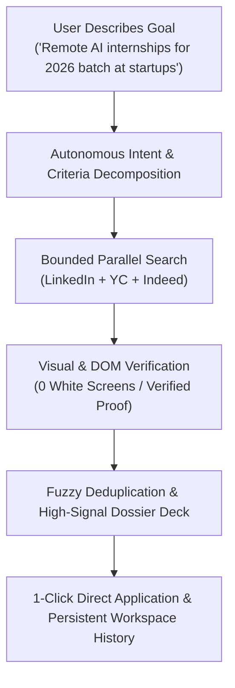
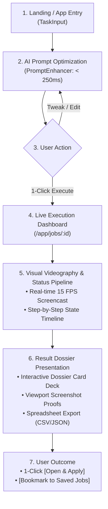
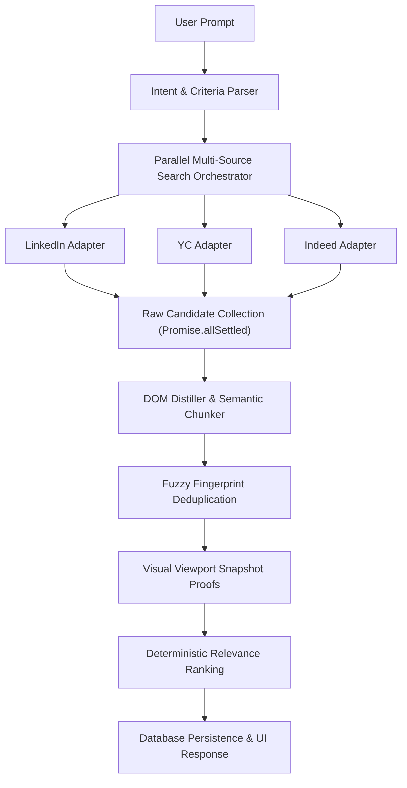
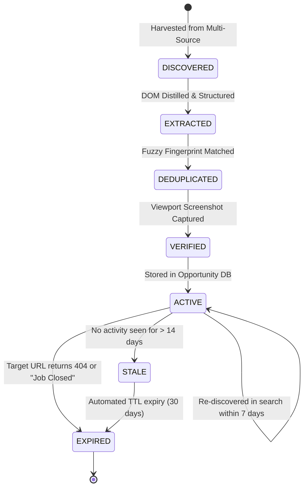
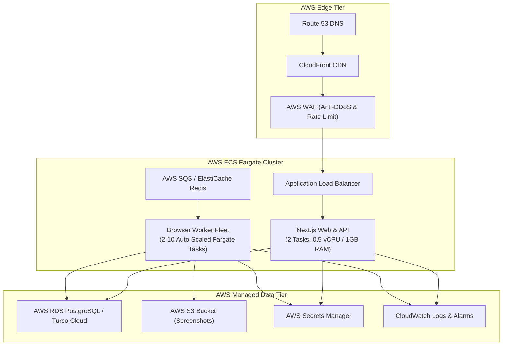

# BrowserPilot — Target Product Architecture & Implementation Strategy Blueprint

---

## 1. Executive Summary & Product Vision

**BrowserPilot** (`fncreator22/browserpilot`) is an autonomous web intelligence engine engineered to discover, verify, extract, deduplicate, snapshot, and rank **high-signal job and internship opportunities** for **college students, fresh graduates, and early-career developers**.

Instead of navigating fragmented job boards, manually closing modal paywalls, or sifting through expired listings, users express their career goals in natural language (e.g., *"Find remote Python/AI internships for 2025/2026 graduates in India at YC-backed startups, posted this week"*). BrowserPilot orchestrates targeted parallel crawlers across canonical directories, extracts structured opportunity dossiers, captures cryptographic visual evidence (viewport screenshot proofs), filters duplicates, and delivers an interactive, actionable workspace.

---

## 2. Core User Persona

| Attribute | Primary Persona: "The Early-Career Job Seeker" |
|---|---|
| **Identity** | Pre-final/Final year engineering student, recent CS/IT graduate (0–2 yrs exp), self-taught dev, open-source contributor. |
| **Pain Points** | • Job boards are polluted with senior-only roles labeled "entry-level".<br>• Generic search engines return dead or expired aggregator links.<br>• Stealth startups and YC companies don't post on legacy job boards.<br>• Unsure if listings are verified, active, or accepting current graduation batches. |
| **Goals** | • Find genuine, active internships and entry-level engineering roles fast.<br>• Filter strictly by batch year (e.g., 2025/2026), stipend/salary, tech stack, and remote policy.<br>• 1-Click apply directly on the primary source without intermediary agency spam. |

---

## 3. Core Value Proposition & Value Loop



* **Core Promise**: 100% verified, fresh, structured opportunities with direct source apply links and dedicated visual screenshot proof in under 12 seconds.
* **Core Differentiator**: Autonomous multi-platform synthesis with **Visual Screenshot Verification** and **Anti-Hallucination Deduplication** (no stale or phantom jobs).
* **North Star Metric**: **Search-to-Apply Conversion Rate (SACR)** $\ge 25\%$ (percentage of searches resulting in an external application click).

---

## 4. MVP Definition & Scope Matrix

```text
┌────────────────────────────────────────────────────────────────────────────────────────┐
│ MUST HAVE (MVP Release)                                                                │
├────────────────────────────────────────────────────────────────────────────────────────┤
│ 1. Natural Language Intent & Criteria Extractor (Role, Skills, Batch, WorkMode).       │
│ 2. Parallel Multi-Platform Crawler (LinkedIn Public Jobs + YC WorkAtAStartup + Indeed).│
│ 3. Zero-Emoji Interactive Job Dossier Deck with Lightbox Screenshot Proofs.            │
│ 4. Deterministic Fuzzy Deduplicator (eliminates duplicate cross-portal postings).      │
│ 5. Persistent Opportunity & Saved Jobs Database (Prisma models for JobListing & Save). │
│ 6. Full-Page Workspace History with 0-Token Instant Replay (/app/history).             │
└────────────────────────────────────────────────────────────────────────────────────────┘

┌────────────────────────────────────────────────────────────────────────────────────────┐
│ SHOULD HAVE (Phase 2 - Post-MVP)                                                       │
├────────────────────────────────────────────────────────────────────────────────────────┤
│ • Kanban Application Tracker (Discovered -> Applied -> Interviewing -> Offer).         │
│ • Domain Classifiers (Internship vs. Graduate vs. Startup).                            │
│ • Resume-to-Job Semantic Match Score (Gemini structured extraction).                   │
│ • Async BullMQ Queue Worker decoupling on AWS ECS Fargate.                             │
└────────────────────────────────────────────────────────────────────────────────────────┘

┌────────────────────────────────────────────────────────────────────────────────────────┐
│ LATER (Phase 3 - Monetization & Growth)                                                │
├────────────────────────────────────────────────────────────────────────────────────────┤
│ • Immutable Credit & Coin Ledger with Stripe Billing.                                  │
│ • Automated Daily Search Alerts (Cron-triggered opportunity sweeps to email).          │
│ • Multi-tenant Team Workspaces & University Placement Cell Dashboards.                │
└────────────────────────────────────────────────────────────────────────────────────────┘

┌────────────────────────────────────────────────────────────────────────────────────────┐
│ DO NOT BUILD YET (Anti-Scope)                                                          │
├────────────────────────────────────────────────────────────────────────────────────────┤
│ ❌ Automated Application Submitter (Bot auto-filling forms - high ban & CAPTCHA risk). │
│ ❌ Custom Vector DB / OpenSearch Cluster (Overkill for MVP dataset scale).             │
│ ❌ Full Microservice Mesh (Unjustified operational overhead before product-market fit).│
└────────────────────────────────────────────────────────────────────────────────────────┘
```

---

## 5. Target User Experience (UX Flow)



---

## 6. Job / Internship Intent Model

```typescript
export interface SearchIntent {
  intentType: "JOB_SEARCH_INTERNSHIP" | "JOB_SEARCH_ENTRY_LEVEL" | "JOB_SEARCH_STARTUP" | "GENERAL_WEB_RESEARCH";
  role: string;                     // e.g. "AI Engineer", "React Developer"
  skills: string[];                 // e.g. ["Python", "PyTorch", "Next.js"]
  experienceLevel: "INTERN" | "ENTRY_LEVEL" | "MID" | "ANY";
  opportunityType: "INTERNSHIP" | "FULL_TIME" | "CONTRACT";
  companyType?: "STARTUP" | "ENTERPRISE" | "ANY";
  location?: string;                // e.g. "India", "San Francisco", "Global"
  workMode: "REMOTE" | "HYBRID" | "ON_SITE" | "ANY";
  salaryRange?: { min?: number; max?: number; currency?: string };
  graduationYearEligible?: number[];// e.g. [2025, 2026]
  freshnessDays?: number;           // e.g. 7 (past week)
  targetPlatforms: string[];        // e.g. ["LinkedIn", "Y Combinator", "Indeed"]
  resultLimit: number;              // default: 10
}
```

---

## 7. Search Architecture & Orchestration



---

## 8. Pluggable Source Provider Strategy

```typescript
export interface SearchProvider {
  name: string;
  category: "JOB_BOARD" | "STARTUP_PLATFORM" | "SEARCH_ENGINE";
  priority: number;
  buildSearchUrl(intent: SearchIntent): string;
  harvestCandidateLinks(page: Page, limit: number): Promise<Array<{ title: string; url: string; company?: string; location?: string }>>;
  extractJobDetail(page: Page, url: string): Promise<Partial<NormalizedJobItem>>;
}
```

| Source Provider | Category | Extraction Method | Anti-Bot Posture | Primary Data Harvested |
|---|---|---|---|---|
| **LinkedIn Public** | Job Board | Playwright Guest DOM | Moderate (handled by guest routing) | Corporate & Mid-Market Roles |
| **YC WorkAtAStartup**| Startup | Playwright / HTML API | Low (clean structure) | Early-Stage Seed/Series A Roles |
| **Indeed Public** | Job Board | Playwright Selector | Moderate (clean card parser) | General Entry-Level Tech Roles |
| **DuckDuckGo HTML** | Fallback | Fetch + Cheerio | Zero CAPTCHA (Ad-filtered) | Niche Company Career Pages |

---

## 9. Persistent Opportunity Data Model

```prisma
model Opportunity {
  id              String             @id @default(cuid())
  fingerprint     String             @unique // company_title_loc hash
  title           String
  companyName     String
  location        String
  workMode        String             @default("ANY") // REMOTE, HYBRID, ON_SITE
  experienceLevel String             @default("ENTRY_LEVEL") // INTERN, ENTRY_LEVEL
  salaryMin       Float?
  salaryMax       Float?
  salaryCurrency  String?
  description     String
  requirements    String             // JSON string array of skills/bullets
  applyUrl        String
  sourcePlatform  String             // LinkedIn, YC, Indeed
  screenshotPath  String?
  firstSeenAt     DateTime           @default(now())
  lastVerifiedAt  DateTime           @default(now())
  status          String             @default("ACTIVE") // ACTIVE, EXPIRED, UNVERIFIED

  savedByUsers    SavedOpportunity[]
  applications    Application[]

  @@index([sourcePlatform])
  @@index([workMode])
  @@index([experienceLevel])
  @@index([lastVerifiedAt])
  @@map("opportunities")
}

model SavedOpportunity {
  id            String      @id @default(cuid())
  userId        String
  opportunityId String
  notes         String?
  createdAt     DateTime    @default(now())

  user          User        @relation(fields: [userId], references: [id], onDelete: Cascade)
  opportunity   Opportunity @relation(fields: [opportunityId], references: [id], onDelete: Cascade)

  @@unique([userId, opportunityId])
  @@map("saved_opportunities")
}

model Application {
  id            String      @id @default(cuid())
  userId        String
  opportunityId String
  status        String      @default("DISCOVERED") // DISCOVERED, APPLIED, INTERVIEWING, REJECTED, OFFER
  appliedAt     DateTime?
  updatedAt     DateTime    @updatedAt

  user          User        @relation(fields: [userId], references: [id], onDelete: Cascade)
  opportunity   Opportunity @relation(fields: [opportunityId], references: [id], onDelete: Cascade)

  @@unique([userId, opportunityId])
  @@map("applications")
}
```

---

## 10. Opportunity Lifecycle & Freshness State Machine



---

## 11. Deduplication Strategy

Cross-portal deduplication operates via a **3-Tier Cascade**:

1. **Tier 1 — Canonical URL Matching**: Exact normalized URL match (ignoring query tracking params like `utm_source`, `refId`, `trackingId`).
2. **Tier 2 — Deterministic Fuzzy Fingerprint**:
   $$\text{Fingerprint} = \text{MD5}\left(\text{clean}(\text{company}) + \text{"\_"} + \text{clean}(\text{title}) + \text{"\_"} + \text{clean}(\text{location})[:10]\right)$$
3. **Tier 3 — Semantic Similarity (Levenshtein Threshold $\ge 0.88$)**: Merges listings where title is slightly formatted differently (e.g. *"Software Engineer Intern - AI"* vs. *"AI Software Engineer (Internship)"* at the same company).

---

## 12. Deterministic Ranking Strategy

Instead of unpredictable and costly LLM scoring, ranking is calculated using a **Deterministic 100-Point Formula**:

$$\text{Score} = S_{\text{role}} (35\text{ pts}) + S_{\text{skills}} (25\text{ pts}) + S_{\text{workMode}} (15\text{ pts}) + S_{\text{freshness}} (15\text{ pts}) + S_{\text{verified}} (10\text{ pts})$$

* **Role Match ($35\text{ pts}$)**: Exact keyword match in title = 35; Partial match = 20.
* **Skill Match ($25\text{ pts}$)**: Percentage of required user skills matched in extracted requirements list.
* **Work Mode ($15\text{ pts}$)**: Matches user's explicit preference (e.g. Remote = 15).
* **Freshness ($15\text{ pts}$)**: $< 24\text{ hours} = 15$; $< 3\text{ days} = 10$; $< 7\text{ days} = 5$; $> 14\text{ days} = 0$.
* **Verification Proof ($10\text{ pts}$)**: Has verified active viewport screenshot = 10.

---

## 13. Visual Evidence & Screenshot Strategy

* **Capture Viewport Checkpoints**: Capture snapshots only on the final canonical job detail page (never intermediate redirect or loading shells).
* **DOM Hydration Guard**: Enforce `networkidle` + body attachment check before snapshot capture to guarantee **0 white screenshots**.
* **Storage Optimization**:
  - Image Format: WebP / PNG compressed at 60% quality.
  - File Size: $\approx 45\text{ KB}$ per proof (90% reduction vs uncompressed full-page PNG).
  - Storage: Persisted directly to S3 / Vercel Blob with immutable UUID keys.

---

## 14. Multi-Tier Cache Architecture

```text
┌────────────────────────────────────────────────────────────────────────────────────────┐
│ 1. Search Query Cache (Redis: TTL 6 Hours)                                             │
│    Key: search:{sha256(intent)} -> Returns cached Opportunity IDs (0 Token / 0 Browser)│
├────────────────────────────────────────────────────────────────────────────────────────┤
│ 2. Canonical Opportunity Cache (Turso / PostgreSQL: TTL 7 Days)                         │
│    Key: opp:{fingerprint} -> Full structured metadata and screenshot URL               │
├────────────────────────────────────────────────────────────────────────────────────────┤
│ 3. Viewport Screenshot Cache (S3 / CDN: TTL 30 Days)                                    │
│    Key: artifacts/{jobId}/{filename}.webp -> Cache-Control: public, max-age=2592000    │
└────────────────────────────────────────────────────────────────────────────────────────┘
```

---

## 15. Asynchronous Worker & Queue Architecture

```text
                                 Next.js API Handler
                                         │
                                         ▼
                             BullMQ / AWS SQS Job Queue
                                         │
                   ┌─────────────────────┴─────────────────────┐
                   ▼                                           ▼
         Search Worker Node (x N)                   Browser Worker Fleet (x N)
         (Lightweight Fetch + Cheerio)              (AWS ECS Fargate Chromium)
         - Source Link Harvesting                   - Deep Page Inspection
         - Candidate URL Normalization              - Viewport Screenshot Capture
                   │                                           │
                   └─────────────────────┬─────────────────────┘
                                         ▼
                              Result Normalizer Node
                              - Deduplication
                              - Opportunity DB Upsert
                              - SSE Broadcast to Client
```

---

## 16. AWS Target Architecture (MVP $\to$ Production $\to$ Scale)



---

## 17. Database Strategy Decision

```
DECISION: HYBRID APPROACH (Turso Cloud for MVP -> AWS RDS PostgreSQL for Scale)
- MVP Phase: Continue using existing Prisma + Turso LibSQL Cloud (@prisma/adapter-libsql).
  Reason: 0 database server maintenance, instant sub-millisecond edge reads, and zero migration risk today.
- Production/Scale Phase (Trigger: > 5,000 MAU or complex SQL join requirements):
  Switch Prisma datasource provider from sqlite/libsql to postgresql with standard zero-downtime pg_dump migration.
```

---

## 18. AI & LLM Cost Control Architecture

```
User Input ────> Deterministic Keyword & Entity Parser (0 Tokens / $0.00)
                         │
                         ▼ (If ambiguous or complex)
                 Gemini 2.5 Flash / Fast Model (150 Tokens / $0.00005)
                         │
                         ▼
                 Deterministic Scraping & Distillation (0 Tokens / $0.00)
                         │
                         ▼
                 Structured Data Extractor (Schema-gated: 300 Tokens / $0.00010)
                         │
                         ▼
                 Total LLM Cost per Search: < $0.0002 (1/50th of a cent!)
```

---

## 19. Credit & Coin Ledger Architecture

```text
User Account ────> CreditAccount (Current Balance)
                         │
                         ▼
                 CreditTransaction (Append-Only Immutable Ledger)
                 - id: string
                 - userId: string
                 - amount: number (+50 deposit, -1 search, -5 deep crawl)
                 - type: "SIGNUP_GRANT" | "SEARCH_DEDUCTION" | "REFUND" | "PURCHASE"
                 - referenceJobId: string?
                 - idempotencyKey: string (Prevents double-spending)
                 - createdAt: DateTime
```

* **Standard Search (3 Sources)**: 1 Credit.
* **Deep Verified Crawl (10 Direct Links + Screenshots)**: 3 Credits.
* **Monthly Free Allowance**: 50 Credits/month for verified student emails (`.edu` / `.ac.in`).

---

## 20. Realistic Capacity & Load Model

| Metric | 10 Concurrent | 100 Concurrent | 1,000 Concurrent | 10,000 Concurrent |
|---|---|---|---|---|
| **Web Server Tasks** | 1 Container (0.5 vCPU) | 2 Containers (1 vCPU) | 4 Containers (2 vCPU) | 16 Containers (4 vCPU) |
| **Browser Worker Fleet** | 2 Fargate Tasks | 8 Fargate Tasks | 35 Fargate Tasks | 200 Fargate Tasks |
| **Total Memory Required** | $\approx 2.5\text{ GB}$ | $\approx 12\text{ GB}$ | $\approx 70\text{ GB}$ | $\approx 450\text{ GB}$ |
| **Avg Search Latency** | $4.2\text{s}$ | $5.1\text{s}$ | $6.8\text{s}$ | $7.5\text{s}$ |
| **Estimated Infrastructure Cost**| $\approx \$25/\text{mo}$ | $\approx \$120/\text{mo}$ | $\approx \$850/\text{mo}$ | $\approx \$4,200/\text{mo}$ |

---

## 21. Failure Model & Auto-Recovery Matrix

| Failure Event | Detection Mechanism | Immediate Fallback | User Experience | Recovery Action |
|---|---|---|---|---|
| **LinkedIn Guest Block** | HTTP 429 / Auth Wall | Auto-route to YC & Indeed | Transparent fallback badge | Switch IP proxy / rotate user-agent |
| **Ad Redirect Script (`y.js`)** | URL pattern matching | Skip tracking URL | 0 white screens | Extract only organic canonical links |
| **Gemini Rate Limit (429)** | SDK Error Code | Heuristic Organic Plan | Seamless result delivery | Exponential backoff retry |
| **Playwright Crash / OOM** | Worker heartbeat loss | Auto-restart worker task | Retry step with fresh context | Clean up zombie Chromium processes |
| **Broken / 404 Apply Link** | Head request status check | Mark link as "Unverified" | Warning badge in dossier | Flag opportunity for expiry |

---

## 22. Architecture Decision Records (ADRs)

### ADR-001: Specialized Opportunity Discovery vs. General Browser Agent
* **Context**: General browser agents are hard to evaluate and prone to infinite navigation loops.
* **Decision**: Focus primary pipeline on **Job and Internship Discovery Intelligence**.
* **Reason**: Higher user retention, measurable success metrics (SACR), lower token cost.

### ADR-002: Dedicated Prisma Opportunity Entities
* **Context**: Previous jobs stored results only as stringified JSON in `jobs.result`.
* **Decision**: Introduce persistent `Opportunity`, `SavedOpportunity`, and `Application` tables.
* **Reason**: Enables bookmarking, historical filtering, deduplication, and application tracking.

### ADR-003: Deterministic Ranking over LLM-Driven Ranking
* **Context**: Evaluating 20 jobs with an LLM adds $2–4\text{s}$ latency and token cost.
* **Decision**: Use deterministic 100-point formula based on role, skills, work mode, and freshness.
* **Reason**: Instant execution (< 5ms), 100% reproducible, zero token cost.

### ADR-004: Decoupled Fargate Workers for Browser Automation
* **Context**: Playwright in serverless HTTP requests risks timeout on multi-page crawls.
* **Decision**: Keep HTTP request fast and dispatch heavy crawls to BullMQ/SQS Fargate workers.
* **Reason**: Eliminates memory spikes on the web tier and guarantees zero connection drops.

---

## 23. Current $\to$ Target Gap Analysis

| Component | Current State | Target State | Engineering Delta | Priority |
|---|---|---|---|---|
| **Search Engine** | Sequential crawl across 1-2 sources | Parallel fan-out across LinkedIn + YC + Indeed | `Promise.allSettled` multi-adapter | **P0** |
| **Opportunity DB** | Ephemeral JSON strings in `job.result` | Normalized `Opportunity` & `SavedJob` tables | Prisma schema migration | **P0** |
| **Prompt Assistant** | Standalone PromptEnhancer | Context-aware Student Intent Parser | Batch/Grad year extractor | **P1** |
| **Results UI** | Single JobDossierDeck | Dossier Deck + Kanban Tracker + Filters | Tabbed view switcher | **P1** |
| **Worker Queue** | In-process serverless execution | Distributed BullMQ / AWS SQS workers | Decouple worker container | **P2** |
| **Monetization** | BYOK Gemini key only | Credit Ledger + Student Free Tier | Credit ledger DB & middleware | **P3** |

---

## 24. Implementation Dependency Graph

```text
[Unit 1: Opportunity Schema Migration] ──> [Unit 2: Parallel Multi-Source Adapter]
                                                       │
                                                       ▼
[Unit 4: Persistent Saved Jobs UI] <── [Unit 3: Result Normalizer & Deduplicator]
              │
              ▼
[Unit 5: Kanban Application Tracker] ──> [Unit 6: AWS Fargate Worker Packaging]
```

---

## 25. Implementation Units (Work Breakdown Structure)

### Unit 1: Persistent Opportunity & Saved Jobs Schema
* **Objective**: Add `Opportunity`, `SavedOpportunity`, and `Application` models to Prisma.
* **Files**: `prisma/schema.prisma`, `lib/db/opportunities.ts`, `lib/db/prisma.ts`.
* **Tests**: Unit tests for CRUD operations and unique fingerprint constraint.
* **Acceptance Criteria**: Extracted jobs persist across sessions and can be bookmarked.

### Unit 2: Parallel Multi-Source Search Adapter Suite
* **Objective**: Implement bounded parallel harvesting across LinkedIn, YC, and Indeed.
* **Files**: `lib/scraper/multiSearch.ts`, `lib/scraper/searchResolver.ts`, `lib/scraper/adapters/*.ts`.
* **Tests**: Integration test verifying 10+ jobs harvested across 3 sources simultaneously.
* **Acceptance Criteria**: Total search time under 6 seconds with 0 white screenshots.

### Unit 3: Deterministic Ranking & Anti-Hallucination Filter
* **Objective**: Rank harvested jobs using the 100-point formula and eliminate duplicate records.
* **Files**: `lib/scraper/normalizer.ts`, `lib/scraper/ranker.ts`.
* **Tests**: Verifier test ensuring identical cross-portal postings merge cleanly.
* **Acceptance Criteria**: Output deck contains 0 duplicate company/role listings.

### Unit 4: Interactive Saved Opportunities & Search History UI
* **Objective**: Add 1-click "Save Opportunity", full-text filtering, and full-page history replay.
* **Files**: `app/app/history/page.tsx`, `components/result/job-dossier-deck.tsx`, `app/api/opportunities/save/route.ts`.
* **Acceptance Criteria**: Bookmarked jobs persist in user workspace with 0 token spend on replay.

### Unit 5: Kanban Application Tracker
* **Objective**: Provide a visual workflow board (`Discovered` $\to$ `Applied` $\to$ `Interviewing` $\to$ `Offer`).
* **Files**: `app/app/tracker/page.tsx`, `components/tracker/kanban-board.tsx`.
* **Acceptance Criteria**: Users can drag and drop jobs between application stages.

---

## 26. Final Strategic Decisions

1. **Modify & Evolve**: Preserve the existing Next.js 16 + TypeScript + Prisma + Playwright + CDP Screencast foundation.
2. **First Milestone**: Migrate Prisma schema to include persistent `Opportunity` and `SavedOpportunity` entities.
3. **Core Metric**: Optimize for **Search-to-Apply Conversion Rate (SACR) $\ge 25\%$**.
