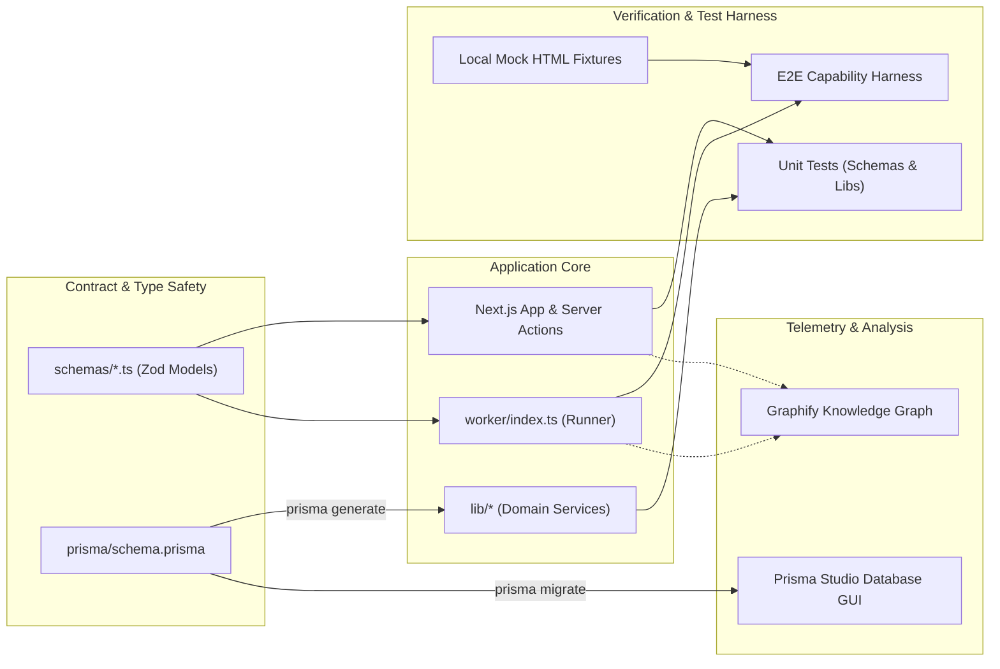

# BrowserPilot Architecture Specification

This document details the architectural layout, core systems, and data pipelines for BrowserPilot.

---

## 1. Runtime Path Architecture

The runtime path describes the lifecycle of an autonomous job: from user submission in the Next.js UI, through queueing, agent reasoning, browser automation, verification, and live telemetry streaming back to the client.

### Runtime Architecture Diagram

```mermaid
flowchart TD
    subgraph Client ["Client Layer (Next.js App Router)"]
        UI["Web Dashboard UI"]
        SSE_Client["SSE Telemetry Listener"]
    end

    subgraph Server ["Server & API Layer"]
        API["POST /api/jobs (Job Dispatcher)"]
        SSE_Route["GET /api/jobs/:id/events (SSE Stream)"]
        DB[(PostgreSQL / Prisma)]
    end

    subgraph Queue ["Asynchronous Queue Layer"]
        Redis[(Redis BullMQ Queue)]
    end

    subgraph Worker ["Worker Execution Engine"]
        Consumer["Job Consumer Worker"]
        Planner["Gemini AI Planning Agent"]
        BrowserWorker["Playwright Browser Controller"]
        Verifier["Capability & Output Verifier"]
        Storage["Artifact & Screenshot Storage"]
    end

    subgraph TargetWeb ["External Environment"]
        WebSite["Target Web Application"]
    end

    UI -->|1. Submit Goal| API
    API -->|2. Persist Job Pending| DB
    API -->|3. Enqueue Job| Redis
    Redis -->|4. Dequeue Task| Consumer
    UI -->|5. Subscribe SSE| SSE_Route
    SSE_Route -.->|Read State| DB

    Consumer -->|6. Reason & Plan Action| Planner
    Planner -->|7. Tool Call| BrowserWorker
    BrowserWorker -->|8. Execute Action (DOM/Click/Fill)| WebSite
    WebSite -->|9. Page State & Snapshot| BrowserWorker
    BrowserWorker -->|10. Observation Feedback| Planner

    Consumer -->|11. Verify Outcome| Verifier
    Consumer -->|12. Store Snapshots & Metrics| Storage
    Consumer -->|13. Update Job State & Emit Events| DB
    DB -.->|14. Push Event Updates| SSE_Route
    SSE_Route -->|15. Stream Updates to UI| SSE_Client
```

### Runtime Path Flow Description
1. **Job Dispatch**: The user enters a natural language goal on the dashboard (`/app`). The client dispatches a POST request to `/api/jobs`.
2. **Persistence & Queueing**: The API validates the payload with Zod, creates a `PENDING` record in PostgreSQL, and enqueues the job into Redis BullMQ.
3. **Worker Dequeue**: A distributed background worker picks up the job and initializes an isolated, ephemeral Playwright browser session.
4. **Agent Reasoning Loop**:
   - The worker captures current page state/DOM and passes it to the Gemini AI Planner.
   - The planner selects one of the 8 deterministic browser tools (e.g., `browser.navigate`, `browser.click`, `browser.fill`).
   - The worker executes the tool, records the observation, saves DOM screenshots to local/cloud storage, and feeds observations back to the planner.
5. **Verification**: The verifier audits the final extracted payload against success criteria or schema expectations.
6. **Telemetry & Live Streaming**: Job milestones, metrics, and screenshots are persisted to PostgreSQL and streamed via Server-Sent Events (SSE) directly to the client's progressive disclosure view.

---

## 2. Developer-Side & Local Workflow Path

The developer path outlines the local tooling, schema contracts, database migration flows, automated test pipelines, and architectural visualization.

### Developer Architecture Diagram



### Developer Path Flow Description
1. **Type & Contract Single Source of Truth**: All domain interfaces originate from Zod schemas in `schemas/` and the Prisma schema in `prisma/`.
2. **Isolated Worker Execution**: Background workers can be launched independently (`npm run worker:dev`) or alongside Next.js (`npm run dev`).
3. **Mock Test Fixtures**: Capability and browser tool tests execute against local static HTML fixtures to guarantee deterministic, zero-cost CI test runs without hitting external websites.
4. **Continuous Verification**: Unit tests validate schemas, sanitization, and prompt templates. E2E harnesses validate full multi-step browser interaction loops.
5. **Architectural Graphing**: Graphify indexes source relationships across components, libraries, schemas, and routes into interactive visual topology graphs (`graphify-out/`).
