# BrowserPilot Agentic Platform Engineering & Architecture Playbook

**Document Type:** Master Architectural Logbook & Evolutionary Strategy Diary  
**Location:** `agentic-platform-playbook.md`  
**Revision:** v3.3 (Comprehensive Architectural Audit, Recruiter Strategy & Defect Remediation)  
**Standard:** DeepSeek Harness (`Agent = Model + Harness`) & Cordis Plugin Architecture  
**Directives:** Zero em dashes, zero en dashes, zero purple or magenta or fuchsia, zero floating eyebrow pills, zero emojis, strictly zero unauthorized code modifications.

---

## 1. Project Diary & Strategic Logbook Context

### 1.1 Where We Started (The Bot Dilemma)
In initial iterations, BrowserPilot was structured around static scraper routines: sending raw HTTP requests with cheerio parsing to guest endpoints (`linkedin.com/jobs-guest`, `indeed.com`, and a hardcoded list of 19 ATS companies). 

**The Breakdown Observed in Production:**
1. Aggregator platforms (Indeed, LinkedIn, Glassdoor) detect non-residential datacenter IP addresses and block requests with Cloudflare Turnstile HTTP 403 or HTTP 999 redirects to login barriers.
2. The UI displayed misleading state: showing 5 "active plugins" (Ashby, Greenhouse, Lever, Workable, LinkedIn) as connected even when the user had not authenticated or connected them.
3. The interface was overburdened with marketing noise: "High Priority Engine" badges, lengthy harvesting distribution explainers, giant header banners ("Autonomous Watch", "Radar Autonomous Opportunity Intelligence"), and duplicate breadcrumb bars that squeezed valuable screen real estate.
4. When users searched colloquial queries (such as `"find me some frontend developer jobs which has been posted in last two or three days"`), the parser failed on word numerals, the scrapers got blocked or had no matching roles among the 19 hardcoded companies, and the user received a fatal `0 Verified Results` screen.

### 1.2 The Strategic Pivot: The True Agentic System
We are transitioning BrowserPilot from a static scraper bot into an **Autonomous Agentic Platform**:
* **Autonomous Intent & Reflexive Loops:** If an initial provider returns 0 items, the agent does not quit; it reflexively queries adjacent roles, executes search index dorking, queries the internal Job Marketplace RAG index, and relaxes freshness boundaries with clear transparency tags.
* **Two-Plane Sandbox Isolation:** User personal data (resumes, queries, notes, watch configurations) is strictly sandboxed in private partitions. Only verified, public job vacancy metadata flows into the Global Job Marketplace.
* **Authentic Plugin Sessions:** Clicking "Connect" on a plugin will open an authentic OAuth/session popup window. Decrypted session cookies are injected into ephemeral Playwright browser contexts for that specific user's searches.
* **Unified Workspace UI:** All redundant headers, taglines, sub-lines, and clutter are purged. Action buttons (`Scan Now`, `Save Watch`, `Save & Search`) move into compact inline utility bars. Plugins move into the centralized Profile Modal.

---

## 2. The 5-Phase Modular Execution Framework

This framework is structured so each phase can be executed independently, combined, or deferred based on token budgets and infrastructure maturity.

```mermaid
flowchart TD
    subgraph Phase1 [Phase 1: UI Declutter & Workspace Optimization]
        P1_1[Purge Monitored Plugins Clutter on /app/watch]
        P1_2[Remove Giant Page Headers & Subtitles]
        P1_3[Relocate Scan & Save Action Buttons to Compact Toolbar]
        P1_4[Remove Radar Eyebrows & Sub-lines on /app]
        P1_5[Eliminate Redundant Breadcrumb Bar in Active Search]
    end

    subgraph Phase2 [Phase 2: Authentic Plugin Popups & Session Vault]
        P2_1[Relocate Plugin Management into Profile Modal]
        P2_2[Implement Real Popup OAuth/Sign-in Window]
        P2_3[AES-256-GCM BrowserSession Encryption in Postgres]
        P2_4[Only Display Genuinely Connected Plugins with Disconnect X]
    end

    subgraph Phase3 [Phase 3: Multi-Tenant Sandbox & Bot Mitigation]
        P3_1[Tenant Partitioning: Strict userId Database Queries]
        P3_2[Ephemeral Playwright BrowserContext with Cookie Injection]
        P3_3[Residential Proxy Pool Routing for Datacenter IP Bypass]
        P3_4[Intent Distillation: Strip User PII from Scraper Queries]
    end

    subgraph Phase4 [Phase 4: Global Job Marketplace & Ingestion Engine]
        P4_1[Marketplace Ingestion Pipeline: Capture All Auxiliary Postings]
        P4_2[Dynamic Posting Age & Verification Decay Engine]
        P4_3[Dedicated /app/marketplace UI with Faceted Filtering]
        P4_4[Zero-Target Category Browsing for Free Tier Users]
    end

    subgraph Phase5 [Phase 5: Agentic RAG & Cloud Infrastructure Transition]
        P5_1[Supabase pgvector Hybrid Search: RAG Retrieval for Zero-Search Prevention]
        P5_2[Admin-Configured Subscription Tier Capability Gating]
        P5_3[Commercial AWS Migration Blueprint: ECS + OpenSearch + SQS]
    end

    Phase1 --> Phase2
    Phase2 --> Phase3
    Phase3 --> Phase4
    Phase4 --> Phase5
```

---

## 3. Execution Log: Screenshot Defect Remediation & Hardening

1. **Defect 1 (Marketplace Job Card Freshness & Details Slide-Over)**:
   - **Root Cause**: Freshness calculation relied on `Opportunity.lastVerifiedAt` (which defaulted to query ingestion time), causing two-week-old jobs to appear as "Posted today". Cards also lacked brief snippet descriptions, circular avatars, and detailed recruiter info.
   - **Remediation**:
     - Created `extractSnippetPostingDate` to parse original dates ("2 weeks ago", "3 days ago") from text snippets before computing decay.
     - Implemented `CompanyAvatar` with Google Favicon resolution and Navy Ink initials.
     - Added 2-line clamped descriptions to marketplace job cards and a slide-over details drawer rendering company info, requirements, skills, and recruiter contacts.
     - Filtered out unverified or placeholder companies (e.g. Acme, Demo Company).

2. **Defect 2 (Duplicate Cancel Notification Spam)**:
   - **Root Cause**: Clicking "Stop" triggered multiple uncoordinated cancel events between `SearchProgress`, `TaskInput`, and parent event listeners without toast IDs.
   - **Remediation**: Created `showDeduplicatedCancelToast` with a singleton ID (`search-cancelled-singleton`) and a 2500ms debounce gate.

3. **Defect 3 (Settings Modal Missing Plugins Tab & Rich Logo Cards)**:
   - **Root Cause**: `CONNECTORS` was defined in `ProfileTab` but omitted from `categories: CategoryNavDef[]`.
   - **Remediation**: Added `CONNECTORS` back with `Blocks` icon. Rendered `ConnectorPreferencesPanel` featuring circular logos (`CompanyAvatar`), clear connection statuses, and popup OAuth triggers.

4. **Defect 4 (Daily Discovery Goal & Monthly AI Operations Quota Tracking)**:
   - **Root Cause**: `POST /api/search` relied on raw JWT user ID without falling back to email resolution in database, leading to unlinked searches. AI usage operations were also not logged for core discovery searches.
   - **Remediation**: Resolved `userId` via email lookup in `POST /api/search` and `lib/db/opportunities.ts`. Recorded discovery operations using `recordAIUsageEvent` in search worker and API handler. Added immediate `loadBilling()` sync when clicking Subscription tab.

5. **Defect 5 (User Memory Vault Structured Form & CGPA Calculation)**:
   - **Root Cause**: Memory management relied on unstructured natural language prompts and separate recommendation cards requiring page redirection.
   - **Remediation**: Built `CareerMemoryForm` supporting target roles, target locations, skills, years of experience (starting at 0 for freshers), degree, core subject, passing year, and CGPA band with auto-computed percentage (`5.0-5.9 [50%-59%]`, `6.0-6.9 [60%-69%]`, `7.0-7.9 [70%-79%]`, `8.0-8.9 [80%-89%]`, `9.0-10.0 [90%-100%]`). Embedded directly into Settings modal (`CAREER_MEMORY`) and `/app/settings/memory`.

---

## 4. Comprehensive Architectural Audit & Strategic Report

### 4.1 DeepReach Recruiter Discovery & Verification Strategy
To move beyond pattern-based heuristics and provide verifiable human contacts (recruiters, hiring managers, engineering leads), the platform implements a three-tier pipeline:

1. **Extraction Tier (Primary Signal Source)**:
   - **ATS Schema Extraction**: Direct parsers for Greenhouse, Lever, Ashby, and Workday inspect `contactPoint`, `creator`, and `author` fields in Schema.org JSON-LD or API payloads.
   - **Jina Reader Search Dorking**: Queries `site:linkedin.com/in ("technical recruiter" OR "talent acquisition" OR "engineering manager") "[company]"` using clean headless proxying.
   - **B2B Identity Enrichment**: Inbound webhooks query Apollo.io, Hunter.io, and RocketReach endpoints for verified domain personnel matching the role family.

2. **Verification & Quality Gate (Zero Hallucination Guarantee)**:
   - **DNS MX Validation**: Checks Node.js `dns.promises.resolveMx(domain)` to guarantee active mail exchangers exist.
   - **Socket-Level SMTP Verification**: Performs non-delivery handshake checks (`HELO` -> `MAIL FROM` -> `RCPT TO`) to confirm the mailbox exists before displaying an email address to candidates.
   - **LinkedIn Profile Liveness**: Verifies the vanity URL returns HTTP 200 via headless fetch without redirecting to a generic 404 or deactivated account page.

3. **Candidate Experience & Outreach**:
   - Surfaces real full names, role titles, and direct outreach options (verified email, LinkedIn message, telephone when published).
   - In the slide-over detail drawer, contacts are categorized by role: `Talent Partner`, `Engineering Manager`, `Recruiting Lead`.

### 4.2 True AI & Agentic Usage Audit
The platform combines deterministic heuristic engines with targeted LLM reasoning:

1. **Intent Parsing & Query Normalization (`lib/ai/intentParser.ts`)**:
   - Parses complex natural language constraints (roles, locations, work modes, graduation batch, temporal windows like "last two weeks").
   - Employs Google Gemini 2.5 Flash (`@google/genai`) or local rule-based AST fallbacks when offline or unconfigured.
   - All executions log token telemetry to Postgres table `ai_usage_events`.

2. **100-Point Fit Scoring & Dimensional Breakdown (`lib/scoring/opportunityScorer.ts`)**:
   - Calculates fit across 5 distinct dimensions: Role Fit (35 pts), Skill Match (25 pts), Work Mode (15 pts), Posting Freshness (15 pts), Verification Integrity (10 pts).
   - Hard freshness decay computes elapsed time from the original post date (parsed from source snippets) rather than when our scraper discovered it.

3. **Autonomous User Memory Vault (`lib/ai/memory/userMemoryVault.ts`)**:
   - Dual-tier memory system: Platform Memory (architecture, decisions) and User Memory (tenant-isolated career preferences, degree, core subject, passing year, CGPA band).
   - Memory Admission Policy evaluates relevance, confidence (`EXPLICIT`, `REPEATED`, `INFERRED`), and lifecycle status (`ACTIVE`, `SUPERSEDED`, `EXPIRED`).

4. **DeepSeek Harness Integration (`lib/agent/harness/deepseekHarness.ts`)**:
   - Stack-agnostic agent runtime architecture (`Agent = Model + Harness`) with append-only trajectory logs and deterministic verification gates.

### 4.3 Plugin Authentication & Session Lifecycle
To harvest protected job boards and social hiring radar channels without security hazards:

1. **Dual Connector Architecture**:
   - **Direct ATS Plugins (`DIRECT_FREE`)**: Ashby, Greenhouse, Lever, Workday require no user authentication and query public API endpoints directly.
   - **Session-Guarded Plugins (`AUTH_REQUIRED`)**: LinkedIn, Twitter/X, Glassdoor require user authentication.

2. **Real OAuth / Popup Sign-in Flow**:
   - Clicking "Connect" opens an isolated popup (`/api/auth/plugins/:id/login`).
   - On authorization, session tokens and encrypted cookies are transferred via postMessage (`PLUGIN_CONNECTED`) and stored in the Postgres `browser_sessions` table.
   - Stored credentials utilize AES-256-GCM encryption with master key derivation via PBKDF2 (`lib/security/credentialEncryption.ts`).
   - Ephemeral Playwright contexts inject cookies only during user-initiated searches and terminate immediately upon completion.
   - Disconnecting a plugin immediately deletes the record from `browser_sessions` and clears the cache.

### 4.4 Orphaned & Dead Code Inventory & Pruning Status
The following legacy and unused files were cataloged and verified:

| Path / Module | Purpose / Initial Status | Pruning Action & Status |
| :--- | :--- | :--- |
| `app/api/auth/demo-session/route.ts` | Temporary demo sign-in endpoint from early prototype | Verified absent; canonical NextAuth credentials flow in effect. |
| `components/showcase/preview-messaging-drawer.tsx` | Static demo drawer with hardcoded mock responses | Safely pruned and removed from showcase index. |
| `scripts/seed-mock-opportunities.ts` | Early development mock data generator | Verified absent; live Prisma and seed mocks replaced. |
| `lib/legacy/staticCompanyList.ts` | Hardcoded 19-company dictionary | Verified absent; dynamic `atsCompanyDirectory` in effect. |
| `components/profile/profile-modal.tsx` | Superseded standalone profile dialog | Safely pruned; unified `settings-modal.tsx` in effect. |

---

## 5. Multi-PR Rollout Architecture & Resilience Strategy (Plan A / B / C)

To guarantee zero production regression on Vercel and preserve full bisectability, the codebase is decomposed into >30 isolated, granular PRs categorized by module:

### 5.1 Rollback & Contained Failure Protocol
- **Plan A (Granular Module Reversion)**: Because changes are sliced into >30 focused PRs (e.g. currency formatting, ATS directory, memory vault, toast debounce, individual UI components, individual API endpoints), any single component failure in production can be reverted via `git revert <commit-hash>` without touching adjacent modules.
- **Plan B (Heuristic & Degradation Fallback)**: If a cloud provider (e.g. Gemini API, Puter, or ATS scraper) experiences an outage, local rule-based AST fallbacks, cached marketplace data, and offline mocks activate automatically without throwing 500 errors to users.
- **Plan C (Fast Admin Emergency Circuit Breakers)**: Platform administrators can toggle emergency halt flags (`/ops-sec-7f9c2d1b8e4a/swarms/control`) to pause background workers or restrict tenant concurrency without redeploying code.

---

*This playbook is maintained as an append-only engineering diary. All future decisions and implementation logs will be recorded herein.*
