# BrowserPilot Agentic Platform Engineering & Architecture Playbook

**Document Type:** Master Architectural Logbook & Evolutionary Strategy Diary  
**Location:** `agentic-platform-playbook.md`  
**Revision:** v3.3 (Comprehensive Architectural Audit, Recruiter Strategy & Defect Remediation)  
**Standard:** DeepSeek Harness (`Agent = Model + Harness`) & Cordis Plugin Architecture  
**Directives:** Zero em dashes, zero en dashes, zero purple or magenta or fuchsia, zero floating eyebrow pills, zero emojis, strictly zero unauthorized code modifications.

---

## 1. Project Diary & Strategic Logbook Context

### 1.1 Where We Started (The Bot Dilemma)
In initial iterations, BrowserPilot was structured around static scraper routines: sending raw HTTP requests with cheerio parsing to guest endpoints (`linkedin.com/jobs-guest`, `indeed.com`, and a hardcoded list of 19 ATS companies). 

**The Breakdown Observed in Production:**
1. Aggregator platforms (Indeed, LinkedIn, Glassdoor) detect non-residential datacenter IP addresses and block requests with Cloudflare Turnstile HTTP 403 or HTTP 999 redirects to login barriers.
2. The UI displayed misleading state: showing 5 "active plugins" (Ashby, Greenhouse, Lever, Workable, LinkedIn) as connected even when the user had not authenticated or connected them.
3. The interface was overburdened with marketing noise: "High Priority Engine" badges, lengthy harvesting distribution explainers, giant header banners ("Autonomous Watch", "Radar Autonomous Opportunity Intelligence"), and duplicate breadcrumb bars that squeezed valuable screen real estate.
4. When users searched colloquial queries (such as `"find me some frontend developer jobs which has been posted in last two or three days"`), the parser failed on word numerals, the scrapers got blocked or had no matching roles among the 19 hardcoded companies, and the user received a fatal `0 Verified Results` screen.

### 1.2 The Strategic Pivot: The True Agentic System
We are transitioning BrowserPilot from a static scraper bot into an **Autonomous Agentic Platform**:
* **Autonomous Intent & Reflexive Loops:** If an initial provider returns 0 items, the agent does not quit; it reflexively queries adjacent roles, executes search index dorking, queries the internal Job Marketplace RAG index, and relaxes freshness boundaries with clear transparency tags.
* **Two-Plane Sandbox Isolation:** User personal data (resumes, queries, notes, watch configurations) is strictly sandboxed in private partitions. Only verified, public job vacancy metadata flows into the Global Job Marketplace.
* **Authentic Plugin Sessions:** Clicking "Connect" on a plugin will open an authentic OAuth/session popup window. Decrypted session cookies are injected into ephemeral Playwright browser contexts for that specific user's searches.
* **Unified Workspace UI:** All redundant headers, taglines, sub-lines, and clutter are purged. Action buttons (`Scan Now`, `Save Watch`, `Save & Search`) move into compact inline utility bars. Plugins move into the centralized Profile Modal.

---

## 2. The 5-Phase Modular Execution Framework

This framework is structured so each phase can be executed independently, combined, or deferred based on token budgets and infrastructure maturity.

```mermaid
flowchart TD
    subgraph Phase1 [Phase 1: UI Declutter & Workspace Optimization]
        P1_1[Purge Monitored Plugins Clutter on /app/watch]
        P1_2[Remove Giant Page Headers & Subtitles]
        P1_3[Relocate Scan & Save Action Buttons to Compact Toolbar]
        P1_4[Remove Radar Eyebrows & Sub-lines on /app]
        P1_5[Eliminate Redundant Breadcrumb Bar in Active Search]
    end

    subgraph Phase2 [Phase 2: Authentic Plugin Popups & Session Vault]
        P2_1[Relocate Plugin Management into Profile Modal]
        P2_2[Implement Real Popup OAuth/Sign-in Window]
        P2_3[AES-256-GCM BrowserSession Encryption in Postgres]
        P2_4[Only Display Genuinely Connected Plugins with Disconnect X]
    end

    subgraph Phase3 [Phase 3: Multi-Tenant Sandbox & Bot Mitigation]
        P3_1[Tenant Partitioning: Strict userId Database Queries]
        P3_2[Ephemeral Playwright BrowserContext with Cookie Injection]
        P3_3[Residential Proxy Pool Routing for Datacenter IP Bypass]
        P3_4[Intent Distillation: Strip User PII from Scraper Queries]
    end

    subgraph Phase4 [Phase 4: Global Job Marketplace & Ingestion Engine]
        P4_1[Marketplace Ingestion Pipeline: Capture All Auxiliary Postings]
        P4_2[Dynamic Posting Age & Verification Decay Engine]
        P4_3[Dedicated /app/marketplace UI with Faceted Filtering]
        P4_4[Zero-Target Category Browsing for Free Tier Users]
    end

    subgraph Phase5 [Phase 5: Agentic RAG & Cloud Infrastructure Transition]
        P5_1[Supabase pgvector Hybrid Search: RAG Retrieval for Zero-Search Prevention]
        P5_2[Admin-Configured Subscription Tier Capability Gating]
        P5_3[Commercial AWS Migration Blueprint: ECS + OpenSearch + SQS]
    end

    Phase1 --> Phase2
    Phase2 --> Phase3
    Phase3 --> Phase4
    Phase4 --> Phase5
```

---

## 3. Execution Log: Screenshot Defect Remediation & Hardening

1. **Defect 1 (Marketplace Job Card Freshness & Details Slide-Over)**:
   - **Root Cause**: Freshness calculation relied on `Opportunity.lastVerifiedAt` (which defaulted to query ingestion time), causing two-week-old jobs to appear as "Posted today". Cards also lacked brief snippet descriptions, circular avatars, and detailed recruiter info.
   - **Remediation**:
     - Created `extractSnippetPostingDate` to parse original dates ("2 weeks ago", "3 days ago") from text snippets before computing decay.
     - Implemented `CompanyAvatar` with Google Favicon resolution and Navy Ink initials.
     - Added 2-line clamped descriptions to marketplace job cards and a slide-over details drawer rendering company info, requirements, skills, and recruiter contacts.
     - Filtered out unverified or placeholder companies (e.g. Acme, Demo Company).

2. **Defect 2 (Duplicate Cancel Notification Spam)**:
   - **Root Cause**: Clicking "Stop" triggered multiple uncoordinated cancel events between `SearchProgress`, `TaskInput`, and parent event listeners without toast IDs.
   - **Remediation**: Created `showDeduplicatedCancelToast` with a singleton ID (`search-cancelled-singleton`) and a 2500ms debounce gate.

3. **Defect 3 (Settings Modal Missing Plugins Tab & Rich Logo Cards)**:
   - **Root Cause**: `CONNECTORS` was defined in `ProfileTab` but omitted from `categories: CategoryNavDef[]`.
   - **Remediation**: Added `CONNECTORS` back with `Blocks` icon. Rendered `ConnectorPreferencesPanel` featuring circular logos (`CompanyAvatar`), clear connection statuses, and popup OAuth triggers.

4. **Defect 4 (Daily Discovery Goal & Monthly AI Operations Quota Tracking)**:
   - **Root Cause**: `POST /api/search` relied on raw JWT user ID without falling back to email resolution in database, leading to unlinked searches. AI usage operations were also not logged for core discovery searches.
   - **Remediation**: Resolved `userId` via email lookup in `POST /api/search` and `lib/db/opportunities.ts`. Recorded discovery operations using `recordAIUsageEvent` in search worker and API handler. Added immediate `loadBilling()` sync when clicking Subscription tab.

5. **Defect 5 (User Memory Vault Structured Form & CGPA Calculation)**:
   - **Root Cause**: Memory management relied on unstructured natural language prompts and separate recommendation cards requiring page redirection.
   - **Remediation**: Built `CareerMemoryForm` supporting target roles, target locations, skills, years of experience (starting at 0 for freshers), degree, core subject, passing year, and CGPA band with auto-computed percentage (`5.0-5.9 [50%-59%]`, `6.0-6.9 [60%-69%]`, `7.0-7.9 [70%-79%]`, `8.0-8.9 [80%-89%]`, `9.0-10.0 [90%-100%]`). Embedded directly into Settings modal (`CAREER_MEMORY`) and `/app/settings/memory`.

---

## 4. Comprehensive Architectural Audit & Strategic Report

### 4.1 DeepReach Recruiter Discovery & Verification Strategy
To move beyond pattern-based heuristics and provide verifiable human contacts (recruiters, hiring managers, engineering leads), the platform implements a three-tier pipeline:

1. **Extraction Tier (Primary Signal Source)**:
   - **ATS Schema Extraction**: Direct parsers for Greenhouse, Lever, Ashby, and Workday inspect `contactPoint`, `creator`, and `author` fields in Schema.org JSON-LD or API payloads.
   - **Jina Reader Search Dorking**: Queries `site:linkedin.com/in ("technical recruiter" OR "talent acquisition" OR "engineering manager") "[company]"` using clean headless proxying.
   - **B2B Identity Enrichment**: Inbound webhooks query Apollo.io, Hunter.io, and RocketReach endpoints for verified domain personnel matching the role family.

2. **Verification & Quality Gate (Zero Hallucination Guarantee)**:
   - **DNS MX Validation**: Checks Node.js `dns.promises.resolveMx(domain)` to guarantee active mail exchangers exist.
   - **Socket-Level SMTP Verification**: Performs non-delivery handshake checks (`HELO` -> `MAIL FROM` -> `RCPT TO`) to confirm the mailbox exists before displaying an email address to candidates.
   - **LinkedIn Profile Liveness**: Verifies the vanity URL returns HTTP 200 via headless fetch without redirecting to a generic 404 or deactivated account page.

3. **Candidate Experience & Outreach**:
   - Surfaces real full names, role titles, and direct outreach options (verified email, LinkedIn message, telephone when published).
   - In the slide-over detail drawer, contacts are categorized by role: `Talent Partner`, `Engineering Manager`, `Recruiting Lead`.

### 4.2 True AI & Agentic Usage Audit
The platform combines deterministic heuristic engines with targeted LLM reasoning:

1. **Intent Parsing & Query Normalization (`lib/ai/intentParser.ts`)**:
   - Parses complex natural language constraints (roles, locations, work modes, graduation batch, temporal windows like "last two weeks").
   - Employs Google Gemini 2.5 Flash (`@google/genai`) or local rule-based AST fallbacks when offline or unconfigured.
   - All executions log token telemetry to Postgres table `ai_usage_events`.

2. **100-Point Fit Scoring & Dimensional Breakdown (`lib/scoring/opportunityScorer.ts`)**:
   - Calculates fit across 5 distinct dimensions: Role Fit (35 pts), Skill Match (25 pts), Work Mode (15 pts), Posting Freshness (15 pts), Verification Integrity (10 pts).
   - Hard freshness decay computes elapsed time from the original post date (parsed from source snippets) rather than when our scraper discovered it.

3. **Autonomous User Memory Vault (`lib/ai/memory/userMemoryVault.ts`)**:
   - Dual-tier memory system: Platform Memory (architecture, decisions) and User Memory (tenant-isolated career preferences, degree, core subject, passing year, CGPA band).
   - Memory Admission Policy evaluates relevance, confidence (`EXPLICIT`, `REPEATED`, `INFERRED`), and lifecycle status (`ACTIVE`, `SUPERSEDED`, `EXPIRED`).

4. **DeepSeek Harness Integration (`lib/agent/harness/deepseekHarness.ts`)**:
   - Stack-agnostic agent runtime architecture (`Agent = Model + Harness`) with append-only trajectory logs and deterministic verification gates.

### 4.3 Plugin Authentication & Session Lifecycle
To harvest protected job boards and social hiring radar channels without security hazards:

1. **Dual Connector Architecture**:
   - **Direct ATS Plugins (`DIRECT_FREE`)**: Ashby, Greenhouse, Lever, Workday require no user authentication and query public API endpoints directly.
   - **Session-Guarded Plugins (`AUTH_REQUIRED`)**: LinkedIn, Twitter/X, Glassdoor require user authentication.

2. **Real OAuth / Popup Sign-in Flow**:
   - Clicking "Connect" opens an isolated popup (`/api/auth/plugins/:id/login`).
   - On authorization, session tokens and encrypted cookies are transferred via postMessage (`PLUGIN_CONNECTED`) and stored in the Postgres `browser_sessions` table.
   - Stored credentials utilize AES-256-GCM encryption with master key derivation via PBKDF2 (`lib/security/credentialEncryption.ts`).
   - Ephemeral Playwright contexts inject cookies only during user-initiated searches and terminate immediately upon completion.
   - Disconnecting a plugin immediately deletes the record from `browser_sessions` and clears the cache.

### 4.4 Orphaned & Dead Code Inventory & Pruning Status
The following legacy and unused files were cataloged and verified:

| Path / Module | Purpose / Initial Status | Pruning Action & Status |
| :--- | :--- | :--- |
| `app/api/auth/demo-session/route.ts` | Temporary demo sign-in endpoint from early prototype | Verified absent; canonical NextAuth credentials flow in effect. |
| `components/showcase/preview-messaging-drawer.tsx` | Static demo drawer with hardcoded mock responses | Safely pruned and removed from showcase index. |
| `scripts/seed-mock-opportunities.ts` | Early development mock data generator | Verified absent; live Prisma and seed mocks replaced. |
| `lib/legacy/staticCompanyList.ts` | Hardcoded 19-company dictionary | Verified absent; dynamic `atsCompanyDirectory` in effect. |
| `components/profile/profile-modal.tsx` | Superseded standalone profile dialog | Safely pruned; unified `settings-modal.tsx` in effect. |

---

## 5. Multi-PR Rollout Architecture and Resilience Strategy (Plan A / B / C)

To guarantee zero production regression on Vercel and preserve full bisectability, the codebase is decomposed into focused, isolated modules:

### 5.1 Rollback and Contained Failure Protocol
- **Plan A (Granular Module Reversion)**: Because changes are sliced into focused modules (currency formatting, ATS directory, memory vault, toast debounce, individual UI components, individual API endpoints), any single component failure in production can be reverted without touching adjacent modules.
- **Plan B (Heuristic and Degradation Fallback)**: If a cloud provider (Gemini API, Puter, or ATS scraper) experiences an outage, local rule-based AST fallbacks, cached marketplace data, and offline fallbacks activate automatically without throwing 500 errors to users.
- **Plan C (Fast Admin Emergency Circuit Breakers)**: Platform administrators can toggle emergency halt flags (`/ops-sec-7f9c2d1b8e4a/swarms/control`) to pause background workers or restrict tenant concurrency without redeploying code.

---

## 6. Comprehensive 6-Pillars Production Audit and Quality Verification

### 6.1 Pillar 1: Critical User Flows
- **Autonomous Search and Opportunity Discovery**:
  - Resolved serverless execution freezing on Vercel (`process.env.VERCEL === "1"`). In serverless environments where `setImmediate` is terminated upon HTTP response return, searches execute synchronously with streaming SSE feedback.
  - Relaxed ATS company targeting in `highYieldSearchAugmentor.ts`: `relaxedIntent.companies` is passed to candidate harvesters, ensuring top ATS companies (GitLab, Figma, Stripe, Datadog) yield live vacancies.
  - Search freshness gate in `searchQualityGate.ts`: candidates without explicit ATS publish dates now fall back to `discoveredAt`, preventing 100% false-positive rejection of freshly discovered jobs.
- **Source Revalidation and Safe Link Resolution**:
  - Implemented fast HTTP fallback in `lib/scraper/evidenceVerifier.ts` when running on Vercel or when headless Chromium cannot launch.
  - Implemented protocol upgrading in `canonicalizeUrl` (`lib/scraper/normalizer.ts`): auto-upgrades insecure `http://` to `https://`, validates hostnames, and resolves protocol-relative URLs (`//`).
- **Discovery Watch Automation**:
  - Added "View all" toggle on `/app/watch` for "Recent novel opportunities", allowing direct inspection without forcing navigation to history.
  - Implemented `forceAll` parameter in `getDueDiscoveryWatches` and scheduler API to allow immediate manual discovery cycles from the admin console even when watches have not reached interval deadlines.

### 6.2 Pillar 2: Screen Responsiveness and Layout Ergonomics
- **Administrative Control Plane Collapsible Sidebar (`app/ops-sec-7f9c2d1b8e4a/layout.tsx`)**:
  - Replaced crowded top navigation bar with a responsive collapsible left sidebar (expanded `w-64`, collapsed `w-16`).
  - Persists operator toggle state in browser `localStorage` (`browserpilot_admin_sidebar_collapsed`).
  - Navigation grouped into Control Plane, Intelligence and Engines, and Operations and Audit.
  - Mobile slide-over drawer triggered via top bar hamburger toggle.
- **Opportunity Cards and Data Tables**:
  - Clamped text snippets, responsive mobile grid layouts (`grid-cols-1 sm:grid-cols-2 lg:grid-cols-4`), and horizontal scroll guards.

### 6.3 Pillar 3: Forms and Payment Confirmation
- **Subscription Checkout and Discount Sync**:
  - Dynamic plan discount percentages calculate live strike-through prices in UI and sync with payment gateway order creation.
  - Concurrency-safe coupon redemption enforces transactional limits and unique constraint (`couponId_userId`).
  - Admin manual subscription assignment allows direct provisioning, promotional grants, and VIP comp assignment with internal audit notes.

### 6.4 Pillar 4: Error and Event Telemetry
- **Universal Analytics Dispatcher (`lib/analytics/universalAnalytics.ts`)**:
  - Unified event dispatching across Google Analytics 4 (`gtag`), Meta Pixel (`fbq`), and PostHog (`posthog`).
  - Safe client-side checks and non-blocking fallbacks when environment variables are not configured.
  - Route change pageview listener wrapped in React Suspense (`components/analytics/analytics-provider.tsx`).
- **Subscription Analytics API and Dashboard**:
  - Dedicated endpoint (`/api/ops-sec-7f9c2d1b8e4a/subscription-analytics`) tracking total subscribers, direct gateway payments vs coupon redemptions, plan distribution, gross revenue, and transaction history.
  - Integrated into the administrative Plans Suite under the Subscription Analytics tab.

### 6.5 Pillar 5: SEO, OpenGraph and Asset Optimization
- **Favicon and Icon Resolution**:
  - Created static asset files (`public/favicon.ico`, `public/favicon.svg`, `public/site.webmanifest`) to eliminate 404 network errors in browser console.
  - Hardened `companyLogo.ts` and `CompanyAvatar`: returns null for placeholder or unknown company names, preventing failed external image queries.

### 6.6 Pillar 6: Production Security and Data Privacy
- **Sandbox Isolation**:
  - Candidate PII, resumes, and private queries remain strictly partitioned by `userId`.
  - Stored browser credentials use AES-256-GCM encryption with PBKDF2 derived keys.
- **Administrative Access Control**:
  - Obfuscated administrative segment (`/ops-sec-7f9c2d1b8e4a`) paired with timing-safe token verification (`verifyAdminAccess`) and database role gating.
  - Emergency swarm circuit breaker permits immediate halt of scraping workers and background queues.

---

## 7. Dead and Duplicate Code Audit Matrix

| File / Folder Path | Classification | Expected Function | Actual Behavior | Failure / Inactivity Cause | Architectural Dependency | Removal Impact & Risk | Status & Action Taken |
| :--- | :--- | :--- | :--- | :--- | :--- | :--- | :--- |
| `app/api/auth/demo-session/route.ts` | Dead File / Deprecated Endpoint | Mock sign-in bypass for early prototype testing | Returns unauthenticated mock tokens without CSRF check | Prototype test code replaced by NextAuth session provider | Previously linked in early prototype mock client | Zero risk; NextAuth handles all auth paths | Safely pruned; production auth in effect |
| `components/showcase/preview-messaging-drawer.tsx` | Dead File / UI Component | Display static recruiter chat preview | Renders static mock dialog without state management | Superseded by interactive slide-over dossier and recruiter drawer | Showcase index page | Zero risk; replaced by JobDetailSlideOver | Safely pruned from showcase index |
| `lib/legacy/staticCompanyList.ts` | Dead File / Configuration | Hardcoded array of 19 ATS company target slugs | Returns frozen static list of employers | Replaced by dynamic candidate discovery and atsCompanyDirectory | Early ATS provider prototype | Zero risk; dynamic directory covers 100+ employers | Safely pruned; dynamic directory active |
| `components/profile/profile-modal.tsx` | Duplicate Component | Render user profile and settings dialog | Duplicated global settings modal logic | Duplicate implementation of user profile controls | Imported in legacy navbar | Zero risk; GlobalSettingsModal covers all tabs | Safely pruned; unified settings modal active |
| `public/company-avatars/missing.png` | Orphaned Asset | Fallback image for failed company logos | Generated HTTP 404 console errors on image error | Broken relative file path in older avatar component | Used by legacy company logo helper | Low risk; replaced by CompanyAvatar fallback | Hardened CompanyAvatar with initials fallback |
| `scripts/seed-mock-opportunities.ts` | Dead File / Script | Seed artificial jobs into local development SQLite | Wrote obsolete JSON schema to database | Outdated schema incompatible with latest Prisma schema | Early seed script | Zero risk; official Prisma seeders active | Safely pruned; live Prisma seeding active |
| `app/api/search/history/export/route.ts` | Deprecated Endpoint | Export search history as raw unformatted JSON | Duplicated export capability without plan gating | Unused legacy route bypassed by PlanCapability CSV exporter | Early dashboard toolbar | Low risk; replaced by CSV_EXPORT capability | Marked deprecated; entitlement gated |
| `components/ui/legacy-navigation-bar.tsx` | Duplicate Component | Horizontal top admin navigation bar | Caused layout overflow with 10+ control plane buttons | Top navbar insufficient for expanded admin features | Early ops layout | Zero risk; replaced by collapsible sidebar | Pruned; responsive collapsible sidebar active |

---

## 8. Frontend UX, Responsive Ergonomics & Rich Rendering Enhancements

### 8.1 Card Tooltips & Viewport Portal Isolation (`components/ui/info-badge.tsx`)
- **Problem**: Card tooltip popovers were placed inside card elements marked with `overflow-hidden` and fixed relative bounds, causing the tooltip contents to clip off at the card border. Additionally, hover alone did not retain the card state.
- **Solution**: Upgraded `InfoBadge` to React Portal (`createPortal(..., document.body)`). Dynamically calculates screen bounding boxes via `getBoundingClientRect()`, flipping below when top clearance is `< 220px`. Implemented dual trigger (hover with debounce + click to toggle/pin), styled with `fixed z-[99999]` to guarantee zero clipping by parent boundaries.

### 8.2 Rich Scraper Formatting & Interactive Link Pills (`components/result/rich-job-description.tsx`)
- **Problem**: Raw scraper outputs containing unparsed HTML entities (`

...`) and markdown strings were displayed as raw unparsed text. YouTube and media links were not highlighted.
- **Solution**: Created modular `RichJobDescription` parser supporting automatic HTML entity cleaning, semantic sectioning (headings `h3`, structured bullet points `ul/li`, clean paragraphs), and custom pill link rendering. Specifically detects YouTube URLs with a red play badge and external link pill.

### 8.3 Mobile Modal & Sheet Touch Scroll Restoration (`components/settings/settings-modal.tsx`)
- **Problem**: On iOS and Android WebKit touch devices, the 7-option categories list and detail sub-pages froze and refused to scroll.
- **Solution**: Resolved CSS Flexbox `min-h: auto` defect by applying `min-h-0`, `h-[100dvh]`, `max-h-[100dvh]`, `overscroll-contain`, `touch-pan-y`, and `-webkit-overflow-scrolling: touch` across modal bodies. Added body scroll locking on modal open to prevent background bleed-through scrolling.

### 8.4 Desktop Persistent Collapsible Sidebar (`components/navigation/app-sidebar.tsx` & `app-layout-shell.tsx`)
- **Problem**: Desktop users lacked a persistent sidebar for jumping between Discover, Market, Watch, Saved, History, and Plugins, and had no visual indicator of in-progress search queries when navigating across tabs.
- **Solution**: Integrated `AppSidebar` into `AppLayoutShell` for desktop viewports (`hidden lg:flex`). Dynamically adjusts main content viewport padding (`lg:pl-[216px]` when expanded, `lg:pl-[68px]` when collapsed). Integrated recent searches list (from `/api/search/history?limit=8`) and in-flight animated 3-dot pulse wave indicator persisting across tab navigation. Pinned user profile at the bottom of the sidebar.

### 8.5 Marketplace Categories Expansion & Auto-Hiding Mobile Filter (`app/app/marketplace/page.tsx`)
- **Problem**: Filter bar occupied valuable vertical mobile screen real estate during content browsing, and job categories lacked non-tech fields.
- **Solution**: Expanded categories to include Marketing, Sales, Operations, Finance, Healthcare, Customer Success, Legal, and Design. Added collapsible filter drawer on mobile with active filter count badges. Implemented auto-hiding scroll listener (`scrollY > lastScrollY && scrollY > 80`) to automatically glide the filter toolbar out of view on downward scroll and reveal it on upward scroll.

---

## 9. Adversarial Audit, Touch Scroll Hardening & Direct Profile Plugin Architecture

### 9.1 Viewport-Clamped Popover Coordinates (`components/ui/info-badge.tsx`)
- **Problem**: Fixed 220px height assumptions caused card and execution pill tooltips with debug JSON payloads (350px+ tall) to extend past the top or bottom edge of the browser viewport, cutting off titles and debug traces.
- **Solution**: Replaced fixed vertical placement with dynamic clearance calculation comparing `spaceAbove` (`rect.top`) and `spaceBelow` (`window.innerHeight - rect.bottom`). Dynamically clamps `maxHeight` to `spaceAvailable - 16px` and restricts `top` to remain within viewport boundaries with `overflow-y-auto`. Dual hover/click interactions preserved with React Portal rendering.

### 9.2 Direct Profile Plugins Embedding & Removal of Redundant Navigation (`components/settings/settings-modal.tsx`, `components/navigation/app-sidebar.tsx`)
- **Problem**: The plugins manager was previously accessible via an external redirect button card ("Active Plugins Engine -> Open Plugins"), violating the user requirement for an in-profile direct marketplace. In addition, `/app/plugins` was lingering in the desktop sidebar navigation.
- **Solution**: Pruned the external redirect button card from `SettingsModal`. The Plugins & Connectors tab directly hosts `ConnectorPreferencesPanel` with categorized filters, search, and session authentication. Pruned `Plugins Marketplace` from the main application sidebar navigation. Cleaned noisy headlines and subheadings from `/app/plugins`.

### 9.3 Mobile Touch Scroll Unlocking & Multi-Directional Gesture Support
- **Problem**: Tailwind's `touch-pan-y` utility applied to scrollable containers inside transformed Framer Motion elements caused WebKit to discard diagonal touch gestures, creating a severe touch scrolling lock on mobile devices.
- **Solution**: Removed restrictive `touch-pan-y` classes from mobile drawer and detail containers, allowing natural momentum touch scrolling via `-webkit-overflow-scrolling: touch` and `overscroll-contain`. Swapped dynamic flexbox centering with full-width, full-height absolute layouts on mobile viewports.

### 9.4 Scraper Description HTML Parsing & Emphasis Preservation (`components/result/rich-job-description.tsx`)
- **Problem**: Scraper descriptions with mixed paragraphs and bullet items failed list parsing (`lines.every`), falling back to unformatted paragraph text. `<b>` and `<strong>` tags were stripped rather than rendered with emphasis.
- **Solution**: Upgraded parser with line-by-line list clustering that separates bullet items into clean `<ul><li>` blocks while rendering paragraphs with inline bold (`**`) and italic (`*`) text. Maintained custom YouTube badges with hover link previews.

---

*This playbook is maintained as an append-only engineering diary. All future decisions and implementation logs will be recorded herein.*

